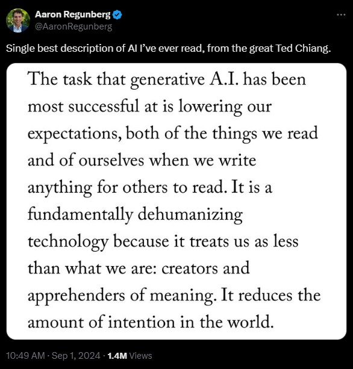

# 431 Class 04: 2024-09-05

[Main Website](https://thomaselove.github.io/431-2024/) | [Calendar](https://thomaselove.github.io/431-2024/calendar.html) | [Syllabus](https://thomaselove.github.io/431-syllabus-2024/) | [Text](https://thomaselove.github.io/431-book/) | [Contact Us](https://thomaselove.github.io/431-2024/contact.html) | [Canvas](https://canvas.case.edu) | [Data and Code](https://github.com/THOMASELOVE/431-data)
:-----------: | :--------------: | :----------: | :---------: | :-------------: | :-----------: | :------------:
for everything | for deadlines | expectations | from Dr. Love | get help | lab submission | for downloads

## Today's Slides

Class | Date | Slides | Word .docx | Quarto .qmd | Recording
:---: | :--------: | :------: | :------: | :------: | :-------------:
04 | 2024-09-05 | **[Slides 04](https://thomaselove.github.io/431-slides-2024/class04.html)** | **[Word 04](https://thomaselove.github.io/431-slides-2024/class04w.docx)** | **[Code 04](https://github.com/THOMASELOVE/431-slides-2024/blob/main/class04.qmd)** | Visit [Canvas](https://canvas.case.edu/), select **Zoom** and **Cloud Recordings**

 This is why I write dates the way I do. [XKCD link](https://xkcd.com/1179)

## Announcements

1. I want to demonstrate how to (1) ask a question (2) answer a question and (3) indicate that you like something on [Campuswire](https://campuswire.com/) today.
2. Feedback on the Minute Paper after Class 3 [is now available](https://bit.ly/431-2024-min-03-feedback). You'll need to log into Google via CWRU to see it.
3. You may want to look [at this link](http://www.stat.columbia.edu/~tzheng/files/Rcolor.pdf) if you're trying to identify the name of a color in R. It's also available [here as a PDF file](Rcolor.pdf).
4. A few thoughts on [Updating R packages](https://thomaselove.github.io/431-2024/software.html#updating-your-r-packages).
5. I hope to have more complete drafts of Chapters 5-8 of [our Course Text](https://thomaselove.github.io/431-book/) available to you in time for Tuesday's class. I'll post to Campuswire as I finish them off.
6. We'll look quickly at [Lab 1](https://github.com/THOMASELOVE/431-labs-2024/blob/main/lab1/431-lab1.pdf), and at [Project A](https://thomaselove.github.io/431-projectA-2024/) today.
7. Today's [Class 4 slides](https://thomaselove.github.io/431-slides-2024/class04.html) take over from where we left off in Class 3, but I have added some materials and changed the order of a few things, to help you with Lab 1, mostly.

-------------

## Ten More Interesting/Fun Facts about Students in this semester's 431 class

1. I enjoy throwing pottery and visited eleven states this summer.
2. I have two cats (Bubbles and Buttercup) that I adopted from a lab (they're retired from being research animals.)
3. I met Chance the Rapper in a bathroom at a Chicago diner.
4. I am a second degree black belt in ninjistu.
5. I love reading and collecting books.
6. I rock climb in my free time, and I am working on getting ready for my lead certification.
7. I am currently a student pilot working towards a pilots license.
8. I am currently re-learning how to to play the saxophone after a 10 year hiatus.
9. I worked at a ski resort growing up and love to snowboard so I'm scared to live in such a flat state.
10. I play tennis for CWRU and we won the school's first NCAA title in history when I was a sophomore.

These come from the Welcome to 431 survey - some more results [are found here](https://github.com/THOMASELOVE/431-classes-2024/blob/main/class02/welcome-report.md).

## One Last Thing

 [Source](https://x.com/AaronRegunberg/status/1830256593868603803) 
