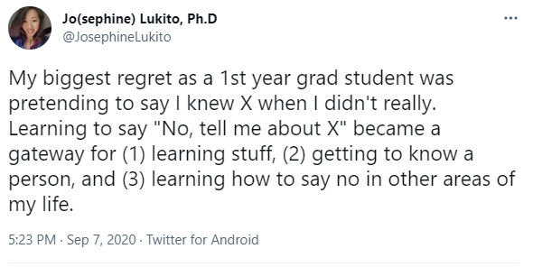

# 431 Class 05: 2024-09-10

[Main Website](https://thomaselove.github.io/431-2024/) | [Calendar](https://thomaselove.github.io/431-2024/calendar.html) | [Syllabus](https://thomaselove.github.io/431-syllabus-2024/) | [Text](https://thomaselove.github.io/431-book/) | [Contact Us](https://thomaselove.github.io/431-2024/contact.html) | [Canvas](https://canvas.case.edu) | [Data and Code](https://github.com/THOMASELOVE/431-data)
:-----------: | :--------------: | :----------: | :---------: | :-------------: | :-----------: | :------------:
for everything | for deadlines | expectations | from Dr. Love | get help | lab submission | for downloads

## Today's Slides

Class | Date | Slides | Word .docx | Quarto .qmd | Recording
:---: | :--------: | :------: | :------: | :------: | :-------------:
05 | 2024-09-10 | **[Slides 05](https://thomaselove.github.io/431-slides-2024/class05.html)** | **[Word 05](https://thomaselove.github.io/431-slides-2024/class05w.docx)** | **[Code 05](https://github.com/THOMASELOVE/431-slides-2024/blob/main/class05.qmd)** | Visit [Canvas](https://canvas.case.edu/), select **Zoom** and **Cloud Recordings**

## Announcements

1. The [course textbook](https://thomaselove.github.io/431-book/) is now ready for you to read through Chapter 8. I hope to get Chapters 9-12 completed soon.
2. If someone answers a question on Campuswire that is useful to you, hit the little up arrow next to the answer. This is how those things float to the top of the discussion.
3. There's also a question about fun things to do in Cleveland in September on [Campuswire](https://campuswire.com/) that you can respond to for a little bonus credit.
4. This Wednesday, you have two things due at noon. They are:
    - [Lab 1](https://github.com/THOMASELOVE/431-labs-2024/tree/main/lab1), which you submit to [Canvas](https://canvas.case.edu/) and
    - The [Minute Paper after Class 5](https://bit.ly/431-2024-minute-05), and to see this, remember to log into Google via your CWRU account.
5. TA office hours continue later today - the [schedule is here](https://thomaselove.github.io/431-2024/contact.html) - just drop in to the Zoom session if you need help.
6. The TAs and I will check all submitted Lab 1 work (all work for Lab 1 should be submitted to [Canvas](https://canvas.case.edu/)) shortly after the deadline.
    - If we don't find your video, your Quarto file **and** your HTML file, or if you've submitted a faulty HTML file (often this is because you left `embed-resources: true` out of the YAML at the start of your Quarto file) we'll inform you via email, and ask you to resubmit. Respond quickly, so as to avoid losing more points than you must.
    - Familiarize yourself with our [late policy for Labs here](https://github.com/THOMASELOVE/431-labs-2024?tab=readme-ov-file#late-policy-no-extensions).
    - If you need to resubmit to [Canvas](https://canvas.case.edu/), please post all three files (video/.qmd/.html) again - it's just easier on the TAs. Don't worry if Canvas adds a number to the filename at the end of your submission.

## Project A - time to get started

Detailed [instructions for Project A](https://thomaselove.github.io/431-projectA-2024/) are available.

- Project A is the first of two real data science projects you’ll be doing this semester. In Project A, you’ll each work with part of the [County Health Rankings 2024](https://www.countyhealthrankings.org/) data. 
- You can *and should* get started on the [Data](https://thomaselove.github.io/431-projectA-2024/data.html) and [Project A Plan](https://thomaselove.github.io/431-projectA-2024/plan.html) materials now. All of that work must be completed by 2024-09-25. The
    - The [Analyses](https://thomaselove.github.io/431-projectA-2024/analyses.html) and [Portfolio](https://thomaselove.github.io/431-projectA-2024/portfolio.html) will be done in October.
- I have provided several [templates for Project A](https://thomaselove.github.io/431-projectA-2024/examples.html) to help you get started.
- You can work alone, or with one other person on Project A. If you work as a pair, you create one project together, and each of you receive the same grade.
    - We'll set aside some time in Thursday's Class 06 to let you chat with others and decide if you might like to work as partners.
- Detailed instructions for Project B will be posted later this semester, but I wouldn't think about that now. Project A is a September/October activity. Project B is a November/December activity.

-------------

## One Last Thing

Here are the movies you sent posters of to describe your favorites, grouped and ordered in a mysterious way to encode some information. It might help you to know that I've been doing this activity each year since 2020. Any guesses as to what the four groups represent?

## Group A

- [Inception](https://www.imdb.com/title/tt1375666/)
- [Pride & Prejudice](https://www.imdb.com/title/tt0414387/)

## Group B

- [The Dark Knight](https://www.imdb.com/title/tt0468569/)
- [Harry Potter and The Sorcerer's Stone](https://www.imdb.com/title/tt0241527/)
- [Lord of the Rings: The Fellowship of the Ring](https://www.imdb.com/title/tt0120737/)
- [The Grand Budapest Hotel](https://www.imdb.com/title/tt2278388/)
- [The Passion of the Christ](https://www.imdb.com/title/tt0335345/)

## Group C

- [Everything, Everywhere, All at Once](https://www.imdb.com/title/tt6710474/)
- [Good Will Hunting](https://www.imdb.com/title/tt0119217/)
- [Inglourious Basterds](https://www.imdb.com/title/tt0361748/)
- [Lord of the Rings: The Two Towers](https://www.imdb.com/title/tt0167261/)
- [Dilwale Dulhania Le Jayenge (The Brave Heart Will Take the Bride)](https://www.imdb.com/title/tt0112870/)
- [Hidden Figures](https://www.imdb.com/title/tt4846340/)
- [The Hunger Games](https://www.imdb.com/title/tt1392170/)
- [Joker](https://www.imdb.com/title/tt7286456/)
- [Kiki's Delivery Service](https://www.imdb.com/title/tt0097814/)
- [Mean Girls](https://www.imdb.com/title/tt0377092/)
- [Porco Rosso (Kurenai no buta)](https://www.imdb.com/title/tt0104652/)
- [The Pursuit of Happyness](https://www.imdb.com/title/tt0454921/)
- [Remember the Titans](https://www.imdb.com/title/tt0210945/)
- [Spirited Away (Sen to Chihiro no Kamikakushi)](https://www.imdb.com/title/tt0245429/)

## Group D

- [Clue](https://www.imdb.com/title/tt0088930/)
- [Doctor Strange](https://www.imdb.com/title/tt1211837/)
- [Finding Nemo](https://www.imdb.com/title/tt0266543/)
- [Gladiator](https://www.imdb.com/title/tt0172495)
- [The Hunt for Red October](https://www.imdb.com/title/tt0099810/)
- [Indiana Jones and the Last Crusade](https://www.imdb.com/title/tt0097576/)
- [Jaws](https://www.imdb.com/title/tt0073195/)
- [A League of their Own](https://www.imdb.com/title/tt0104694)
- [National Treasure](https://www.imdb.com/title/tt0368891/)
- [Talladega Nights: The Ballad of Ricky Bobby](https://www.imdb.com/title/tt0415306/)
- [Weird: The Al Yankovic Story](https://www.imdb.com/title/tt17076046/)
- [The Wolf of Wall Street](https://www.imdb.com/title/tt0993846)
- [Chinese Doctors (Zhong guo yi sheng)](https://www.imdb.com/title/tt13696296/)
- [The Conversation](https://www.imdb.com/title/tt0071360/)
- [The Devil Wears Prada](https://www.imdb.com/title/tt0458352)
- [Fantastic Mr. Fox](https://www.imdb.com/title/tt0432283/)
- [Flipped](https://www.imdb.com/title/tt0817177/)
- [Inside Out 2](https://www.imdb.com/title/tt22022452)
- [Legally Blonde](https://www.imdb.com/title/tt0250494/)
- [Minions: The Rise of Gru](https://www.imdb.com/title/tt5113044/)
- [Om Shanti Om (Peace Be With You)](https://www.imdb.com/title/tt1024943)
- [Princess Mononoke (Mononoke-hime)](https://www.imdb.com/title/tt0119698/)
- [Scooby-Doo on Zombie Island](https://www.imdb.com/title/tt0166792)
- [The Shining](https://www.imdb.com/title/tt0081505)
- [Shrek 2](https://www.imdb.com/title/tt0298148)
- [Zindagi Na Milegi Dobara (You Only Live Once)](https://www.imdb.com/title/tt1562872)

