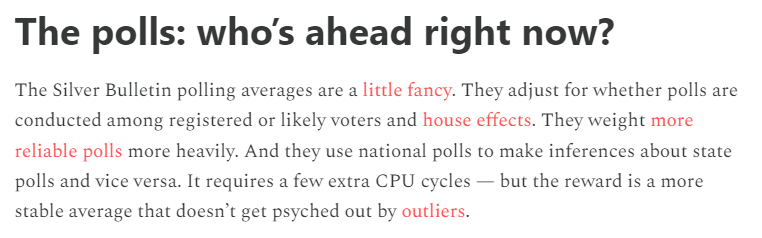
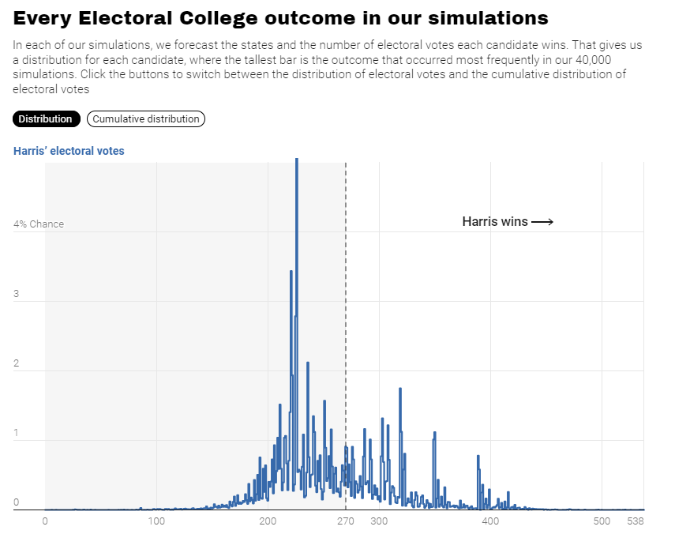

# 431 Class 06: 2024-09-12

[Main Website](https://thomaselove.github.io/431-2024/) | [Calendar](https://thomaselove.github.io/431-2024/calendar.html) | [Syllabus](https://thomaselove.github.io/431-syllabus-2024/) | [Text](https://thomaselove.github.io/431-book/) | [Contact Us](https://thomaselove.github.io/431-2024/contact.html) | [Canvas](https://canvas.case.edu) | [Data and Code](https://github.com/THOMASELOVE/431-data)
:-----------: | :--------------: | :----------: | :---------: | :-------------: | :-----------: | :------------:
for everything | for deadlines | expectations | from Dr. Love | get help | lab submission | for downloads

## Today's Slides

Class | Date | Slides | Word .docx | Quarto .qmd | Recording
:---: | :--------: | :------: | :------: | :------: | :-------------:
06 | 2024-09-12 | **[Slides 06](https://thomaselove.github.io/431-slides-2024/class06.html)** | **[Word 06](https://thomaselove.github.io/431-slides-2024/class06w.docx)** | **[Code 06](https://github.com/THOMASELOVE/431-slides-2024/blob/main/class06.qmd)** | Visit [Canvas](https://canvas.case.edu/), select **Zoom** and **Cloud Recordings**

**NEW!** [Go here](https://thomaselove.github.io/431-2024/software.html#getting-better-at-r-rstudio-and-quarto) for suggested R/RStudio/Quarto learning resources.

## Announcements

1. Dr. Love's feedback on the Minute Paper after Class 5 [is now available](https://bit.ly/431-2024-min-05-feedback).
2. The Answer Sketch for Lab 1 will be posted to our **Shared Google Drive** on Friday 2024-09-13 at noon.
3. I updated [the book's Chapter 3](https://thomaselove.github.io/431-book/03_summary.html) to fix a couple of typos a student found on Campuswire. **PLEASE** help me in this way if you find anything that seems wrong, or confuses you!
4. We'll spend some time making sure you have a chance to **discuss working on Project A with a partner**, and address any of your questions about the Data or Plan activities in Project A.

-----------

## Ten More Interesting/Fun Facts about Students in this semester's 431 class

1. I've been to the southernmost point of the African continent.
2. I play the flute and clarinet and have been an Indian classical dancer for the past 12 years.
3. I am a certified yoga instructor.
4. I like doing jigsaw puzzles.
5. I love traveling because it gives me the chance to meet people from different cultures, learn about their unique perspectives, and, of course, try new and exciting food!
6. I was born in Ramsar, a city in Iran with the highest natural background radiation level in the world.
7. I enjoy making wire flowers and designing t-shirts.
8. I have a hairless cat (sphynx) named Toby and he is the love of my life!
9. I obtained my PhD last year and am back at school to learn more.
10. In my free time, I am the executive director of Cleveland Community Cat Project, a nonprofit organization dedicated to community cat welfare that I founded several years ago.

## One Last Thing

From Nate Silver and Eli McKown-Dawson at [Silver Bulletin](https://www.natesilver.net/) posted 2024-09-11.

