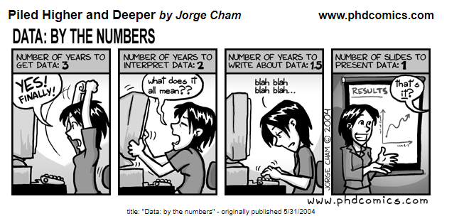
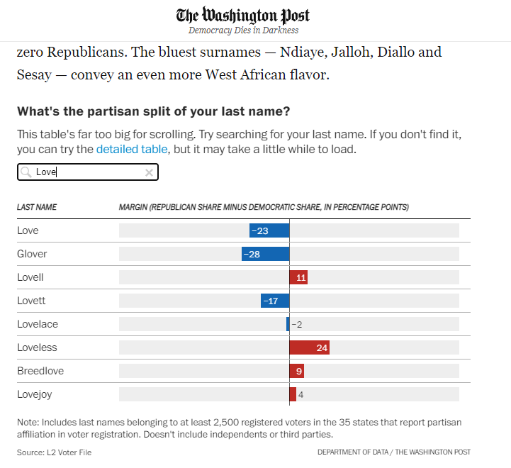

# 431 Class 09: 2024-09-24

[Main Website](https://thomaselove.github.io/431-2024/) | [Calendar](https://thomaselove.github.io/431-2024/calendar.html) | [Syllabus](https://thomaselove.github.io/431-syllabus-2024/) | [Text](https://thomaselove.github.io/431-book/) | [Contact Us](https://thomaselove.github.io/431-2024/contact.html) | [Canvas](https://canvas.case.edu) | [Data and Code](https://github.com/THOMASELOVE/431-data)
:-----------: | :--------------: | :----------: | :---------: | :-------------: | :-----------: | :------------:
for everything | for deadlines | expectations | from Dr. Love | get help | lab submission | for downloads

- Suggested [R/RStudio/Quatro learning resources](https://thomaselove.github.io/431-2024/resources.html)

## Today's Slides

Class | Date | Slides | Word .docx | Quarto .qmd | Recording
:---: | :--------: | :------: | :------: | :------: | :-------------:
09 | 2024-09-24 | **[Slides 09/10](https://thomaselove.github.io/431-slides-2024/class09.html)** | **[Word 09/10](https://thomaselove.github.io/431-slides-2024/class09w.docx)** | **[Code 09/10](https://github.com/THOMASELOVE/431-slides-2024/blob/main/class09.qmd)** | Visit [Canvas](https://canvas.case.edu/), select **Zoom** and **Cloud Recordings**

 [Source](https://phdcomics.com/comics.php?f=462)

## Announcements

1. The answer sketch for Lab 2 is available in our Shared Drive folder, and Lab 2 grades and feedback on Lab 2 are posted to the Student Grade Roster in our Shared Drive folder, too.
    - For one student, we had a problem on our end with Task 3, and we'll get a grade and comments posted on that **soon**.
2. You can use [LaTeX commands within Quarto](https://quarto.org/docs/visual-editor/technical.html). Just enclose them in dollar signs, like `$\leq$`, which produces $\leq$, or `$\geq$, which is $\geq$.
    - Check out the bottom of [this page](https://www.overleaf.com/learn/latex/Mathematical_expressions) for a brief reference guide and links to learn more.
3. Lots of good questions [on Campuswire](https://campuswire.com/) this week. Thanks!
4. There is no Minute Paper this week. The next [Minute Paper will follow Class 11](https://github.com/THOMASELOVE/431-minute-2024).
5. Chapters 1-15 in the [Course Book](https://thomaselove.github.io/431-book/) are now ready for your review. We'll start working on material from Chapters 13-14 next week. Note that Chapter 15 isn't happening this Fall - I'll put my efforts instead into the slides where I discuss that material, for classes 13 and 14. I also cleaned up some equations that were on top of each other in the Task 1 discussion in Section 7  thanks to an alert student.
6. Today's slides will be used in Class 09 and Class 10.

## Project A reminders/information

1. In Project A,
    - the only things that really ought be factors are the `state` variable and the binary version of your Analysis 2 outcome.
    - you should be using `droplevels()` (which drops unused levels from all factors) once you have an otherwise clean `chr_2024`, and before you save the .Rds file.
    - you should review the general tips [posted here](https://github.com/THOMASELOVE/431-labs-2024/blob/main/tips.md) for Labs and Project work.
2. A [sample plan for Project A](https://rpubs.com/TELOVE/ProjectA-sample-plan-431-2024) is now available.
    - We'll look at **section 10.4** in class, in particular. See my note (#71) on Campuswire about this, as well, if you like.
3. Here is a list of [the 17 elements TAs and I will be reviewing](https://github.com/THOMASELOVE/431-classes-2024/blob/main/projectA/plan_checklist.md) in your Project A Plans.
    - The bottom of the list (after element Q) includes some general comments about how ACCEPT/REDO decisions will be made, and the impact of those decisions on your grade.
4. Please don't forget to submit all **three** necessary parts of the Project A Plan to [Canvas](https://canvas.case.edu) by Wednesday at noon.
    - The three parts are (1) the analytic tibble (.Rds file), (2) your Quarto (.qmd file), and (3) your HTML result of rendering your Quarto file.
    - The resulting HTML document will have 14 sections. Be sure they all appear in your Table of Contents, and that the links in that Table of Contents work.
    - If you are working with a partner, **exactly one** of you should submit the materials to [Canvas](https://canvas.case.edu), and the **other partner** should submit a text document (Word or PDF is fine) to Canvas that reads: "My name is [YOUR NAME]. I am working on Project A with [INSERT FULL NAME OF YOUR PARTNER], and they will submit the materials for the Plan". This, too, is due by Wednesday at noon.
    - Late work (arriving after 1 PM Wednesday) will cost you 3 of the available 20 points in the Project A Plan, assuming we have your Plan before noon Thursday. Don't be late, please - it will be a big problem.

## Favorite Movies

I have prepared two sets of results for you from the first Movie Breakout Activity.

1. [At this link](https://github.com/THOMASELOVE/431-classes-2024/blob/main/movies/breakout1_results.md), you will find some detailed feedback on the research questions you suggested, as well as a table of the first movie all members of each of the ten groups said they had seen.
2. For more statistical results addressing some of the questions posed, see the Slides for Classes 09 and 10.

-----------

## One Last Thing

We'll visit [Political leanings of first and last names](https://flowingdata.com/2024/09/20/political-leanings-of-first-and-last-names/) at <https://flowingdata.com/>.

- You can read the *Washington Post* article at [this link](https://www.washingtonpost.com/business/2024/09/13/popular-names-republican-democrat/)

