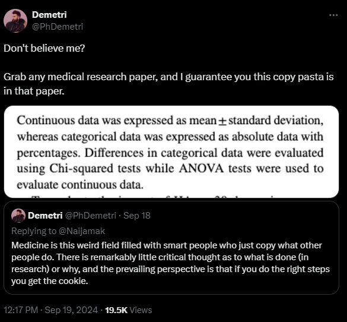

# 431 Class 12: 2024-10-03

[Main Website](https://thomaselove.github.io/431-2024/) | [Calendar](https://thomaselove.github.io/431-2024/calendar.html) | [Syllabus](https://thomaselove.github.io/431-syllabus-2024/) | [Text](https://thomaselove.github.io/431-book/) | [Contact Us](https://thomaselove.github.io/431-2024/contact.html) | [Canvas](https://canvas.case.edu) | [Data and Code](https://github.com/THOMASELOVE/431-data)
:-----------: | :--------------: | :----------: | :---------: | :-------------: | :-----------: | :------------:
for everything | for deadlines | expectations | from Dr. Love | get help | lab submission | for downloads

- Suggested [R/RStudio/Quatro learning resources](https://thomaselove.github.io/431-2024/resources.html)

## Today's Slides

Class | Date | Slides | Word .docx | Quarto .qmd | Recording
:---: | :--------: | :------: | :------: | :------: | :-------------:
12 | 2024-10-03 | **[Slides 12](https://thomaselove.github.io/431-slides-2024/class12.html)** | **[Word 12](https://thomaselove.github.io/431-slides-2024/class12w.docx)** | **[Code 12](https://github.com/THOMASELOVE/431-slides-2024/blob/main/class12.qmd)** | Visit [Canvas](https://canvas.case.edu/), select **Zoom** and **Cloud Recordings**

## Announcements

1. The Lab 3 grading rubric is available in our Shared Drive folder (in the Lab Answer Sketches sub-folder), in both .qmd and .html format.
    - There's no Lab 3 answer sketch coming, since each Task requires different answers from every student.
2. Feedback on the Minute Paper after Class 11 is now available at <https://bit.ly/431-2024-min-11-feedback>.
3. Feedback on all revised Project A Plans should be available by class time.
    - Review status [is posted here](https://github.com/THOMASELOVE/431-classes-2024/blob/main/projectA/projectA_teams.md); comments on revisions will be found on [Canvas](https://canvas.case.edu).
    - Once we've accepted your Project A Plan, you should move on to building the rest of the Project, specifically the [Analyses](https://thomaselove.github.io/431-projectA-2024/analyses.html) and then the full [Portfolio](https://thomaselove.github.io/431-projectA-2024/portfolio.html).
    - A very common problem is having the wrong Year(s) for the data in your Codebook (Section 11) - **even if I've accepted your Plan**, check to see that this is correct in your case. The years for all CHR 2024 data except `county_clustered` should be **before 2024** - in some cases, several years before. The years for the variable that comes from 2019 should be specified and be **before 2019** in your codebook as well.  Review the instructions at [this link](https://thomaselove.github.io/431-projectA-2024/data.html#sources-and-years-for-chr-2019-variables) which provides the location of the source years for CHR 2019 and tells you where to find it for CHR 2024 and get this fixed. We will definitely check this in reviewing your portfolio.
4. Lab 4 is due at noon on Wednesday. It was updated (slightly) on 2024-10-01 to clarify that no Lab 4-specific template is available, but you can create one using the previous Lab templates.

. [Source](https://x.com/phdemetri/status/1836801893437219321)

-----------

## Favorite Movies Second Breakout Session

We'll have our [second breakout session](https://github.com/THOMASELOVE/431-classes-2024/blob/main/movies/breakout2.md) about the favorite movies data today, after the announcements. 

**NOTE**: I'll pause the class recording once you're all working on this, so the eventual recording will be shorter than our other class sessions so far.

---------------

## One Last Thing

[Perceptions of Probability and Numbers](https://github.com/zonination/perceptions)

