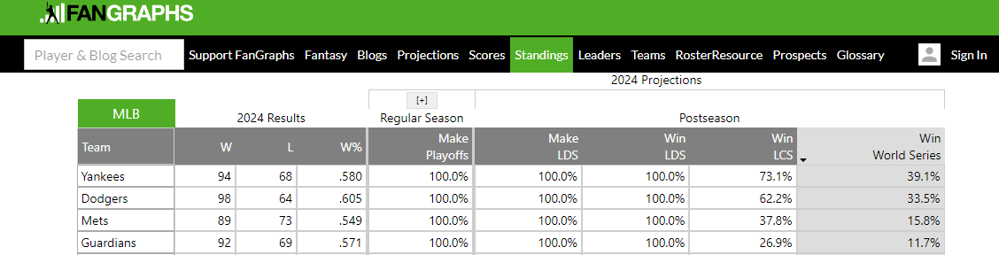

# 431 Class 15: 2024-10-15

[Main Website](https://thomaselove.github.io/431-2024/) | [Calendar](https://thomaselove.github.io/431-2024/calendar.html) | [Syllabus](https://thomaselove.github.io/431-syllabus-2024/) | [Text](https://thomaselove.github.io/431-book/) | [Contact Us](https://thomaselove.github.io/431-2024/contact.html) | [Canvas](https://canvas.case.edu) | [Data and Code](https://github.com/THOMASELOVE/431-data)
:-----------: | :--------------: | :----------: | :---------: | :-------------: | :-----------: | :------------:
for everything | for deadlines | expectations | from Dr. Love | get help | lab submission | for downloads

- Suggested [R/RStudio/Quatro learning resources](https://thomaselove.github.io/431-2024/resources.html)

## Seven (or Eight) More Wins...

## Today's Slides

Class | Date | Slides | Word .docx | Quarto .qmd | Recording
:---: | :--------: | :------: | :------: | :------: | :-------------:
15 | 2024-10-15 | **[Slides 15](https://thomaselove.github.io/431-slides-2024/class15.html)** | **[Word 15](https://thomaselove.github.io/431-slides-2024/class15w.docx)** | **[Code 15](https://github.com/THOMASELOVE/431-slides-2024/blob/main/class15.qmd)** | Visit [Canvas](https://canvas.case.edu/), select **Zoom** and **Cloud Recordings**

## Announcements

1. Remember to complete Quiz 1 by the deadline, which is noon Wednesday (2024-10-16). The Google Form will close promptly at 1 PM. If you have questions, ask them before 10 AM Wednesday via email to Dr. Love at `thomas dot love at case dot edu`. Good luck!
2. Chapters 16-18 of the [Course Book](https://thomaselove.github.io/431-book/) are now available for your review. In addition, I fixed a very small typo in Chapter 13, and added README links to Chapter 15. I'm still working on Chapters 19-23.
3. A reminder that we don't have class next Tuesday 2024-10-22, and that office hours are canceled on Monday 2024-10-21 and Tuesday 2024-10-22. Enjoy your Fall Break.
4. There is no Minute Paper this week. The next Minute Paper is after Class 18 (and is due Wednesday 2024-10-30.)
5. The next deliverable date after Quiz 1 is for the [Project A Portfolio](https://thomaselove.github.io/431-projectA-2024/portfolio.html) due at noon on Wednesday 2024-10-30. 

---

## Favorite Movies Breakout 3

A new version (dated 2024-10-15) of the favorite movies data, incorporating [several of your suggested additions](https://github.com/THOMASELOVE/431-classes-2024/tree/main/movies#breakout-session-2), is now available in our Shared Google Drive folder.

- New variables include information on the [Bechdel-Wallace rating](https://bechdeltest.com/), [Academy Awards](https://www.oscars.org/) and other award wins gathered at [IMDB](https://www.imdb.com/), budgets and revenue results from [The-Numbers](https://the-numbers.com/), rankings from [Flickchart](https://www.flickchart.com/) and [Rotten Tomatoes](https://www.rottentomatoes.com/), potentially triggering events from [doesthedogdie](https://www.doesthedogdie.com/), ratings of sex and nudity, violence and gore, and language, from [kids-in-mind](https://kids-in-mind.com/), as well as streaming information, and expanded indicator variables for IMDB's top 12 genres across our 228 movies.
- A brief summary of your proposed variables and exploratory questions is available in these [breakout 2 results](https://github.com/THOMASELOVE/431-classes-2024/blob/main/movies/breakout2_results.md). 

## Come see me in Agatha Christie's "And Then There Were None"!

October 25 - November 16, 2024 on Fridays and Saturdays at 7:30 PM. Tickets and more information at <https://www.auroracommunitytheatre.com/>. My [theater page is here](https://github.com/THOMASELOVE/theater), if you're interested.

---

## After The Slides

We'll do [Breakout Activity 3 about our Favorite Movies](https://github.com/THOMASELOVE/431-classes-2024/blob/main/movies/breakout3.md).

## One Last Thing

