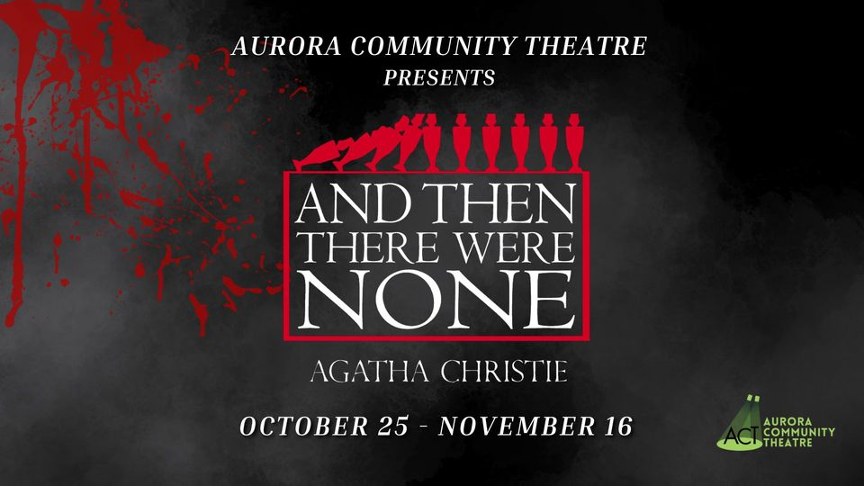

# 431 Class 16: 2024-10-17

[Main Website](https://thomaselove.github.io/431-2024/) | [Calendar](https://thomaselove.github.io/431-2024/calendar.html) | [Syllabus](https://thomaselove.github.io/431-syllabus-2024/) | [Text](https://thomaselove.github.io/431-book/) | [Contact Us](https://thomaselove.github.io/431-2024/contact.html) | [Canvas](https://canvas.case.edu) | [Data and Code](https://github.com/THOMASELOVE/431-data)
:-----------: | :--------------: | :----------: | :---------: | :-------------: | :-----------: | :------------:
for everything | for deadlines | expectations | from Dr. Love | get help | lab submission | for downloads

- Suggested [R/RStudio/Quatro learning resources](https://thomaselove.github.io/431-2024/resources.html)

## Today's Slides

Class | Date | Slides | Word .docx | Quarto .qmd | Recording
:---: | :--------: | :------: | :------: | :------: | :-------------:
16 | 2024-10-17 | **[Slides 16](https://thomaselove.github.io/431-slides-2024/class16.html)** | **[Word 16](https://thomaselove.github.io/431-slides-2024/class16w.docx)** | **[Code 16](https://github.com/THOMASELOVE/431-slides-2024/blob/main/class16.qmd)** | Visit [Canvas](https://canvas.case.edu/), select **Zoom** and **Cloud Recordings**

## Announcements

1. Lab 4 grades and feedback are posted to our Grading Roster in our Shared Google Drive folder. 
2. Our next class (Class 17) will be Thursday 2024-10-24. It will be an "Ask Me Anything" / Project A Help Session conducted by Dr. Love over Zoom, rather than in person.
3. Class is cancelled on Tuesday 2024-10-22 and Office hours are canceled on Monday 2024-10-21 and Tuesday 2024-10-22. Enjoy your Fall Break.
4. Our next in-person class will be Class 18, on Tuesday 2024-10-29.
5. Part of today's class will be devoted to discussing the [results from Breakout Activity 3](https://github.com/THOMASELOVE/431-classes-2024/blob/main/movies/breakout3_results.md) (in the Favorite Movies saga.)

## Quiz 1 

- **Later today**, you will receive an email from me containing:
    - your answers to every question, and the answer key
    - a breakdown of the points you received on every question
    - your raw and final score on the Quiz
- A set of Answers and a summary of Results across all 54 students is **available now** as a PDF in our Shared Google Drive folder. Look for the "Answers and Results for Quiz 1" subfolder within "431 Quiz 1 Materials." It's a 45 page document, so it'll take you some time to look through it all.
    - Nonetheless, I'm asking you to read through the document and the email I will send to you **before** you ask me any questions about grading and the Quiz. I am very likely to have answered your question within those documents.
- At the end of the PDF document is a summary of how the class did, and an **explanation** of how your score on Quiz 1 was calculated.
- Most of the grades were in the A or B range, so that's great.
- Here is our advice to you about the Quiz...
    1. If, after you get your email with your grade, you realize that you didn't do as well as you'd like on the Quiz, go over the provided Answer Sketch (PDF) in our Shared Google Drive folder to see where you went wrong, and if you still don't understand something about why my answer is correct, ask us about it on Campuswire or in TA office hours. If you have a question about grading, specifically, on Quiz 1, email Dr. Love **before October 24** after which time he will consider Quiz 1 closed. Then forget about the Quiz, and work on Project A.
    2. If, after you get your email with your grade, you realize that you did do well on the Quiz, great! Go over the provided Answer Sketch (PDF) in our Shared Google Drive folder to see where you had trouble matching our response, and if you still don't understand something about why my answer is correct, ask us about it on Campuswire or in TA office hours. If you have a question about grading, specifically, on Quiz 1, email Dr. Love **before October 24** after which time he will consider Quiz 1 closed. Then forget about the Quiz, and work on Project A.

## References related to Multiple Imputation and Today's Slides

- Sterne JAC et al [Multiple imputation for missing data in epidemiological and clinical research: potential and pitfalls](https://www.bmj.com/content/338/bmj.b2393) BMJ 2009; 338:b2393.
- [Flexible Imputation of Missing Data, 2nd edition](https://stefvanbuuren.name/fimd/) by Stef Van Buuren
- The mice (Multivariate Imputation by Chained Equations) package [reference page](https://amices.org/mice/).
    - Stef van Buuren, Karin Groothuis-Oudshoorn (2011). [mice: Multivariate Imputation by Chained Equations in R](https://www.jstatsoft.org/article/view/v045i03). Journal of Statistical Software, 45(3), 1-67. DOI 10.18637/jss.v045.i03.
- Heymans MW and Eekhout I [Applied Missing Data Analysis with SPSS and RStudio](https://bookdown.org/mwheymans/bookmi/)
- The `mipo` (Multiple Imputation pooled object) help file [can be found here](https://rdrr.io/cran/mice/man/mipo.html).
- [Getting Started with Multiple Imputation in R](https://library.virginia.edu/data/articles/getting-started-with-multiple-imputation-in-r)
- [Multiple Imputation with the mice package](https://rmisstastic.netlify.app/tutorials/erler_course_multipleimputation_2018/erler_practical_mice_2018)

## One Last Thing

, from [Are Republican pollsters “flooding the zone?”](https://www.natesilver.net/p/are-republican-pollsters-flooding) by Eli McKown-Dawson at Silver Bulletin posted 2024-10-16.

## Come see me in Agatha Christie's "And Then There Were None"!

October 25 - November 16, 2024 on Fridays and Saturdays at 7:30 PM. Tickets and more information at <https://www.auroracommunitytheatre.com/>. My [theater page is here](https://github.com/THOMASELOVE/theater), if you're interested.

