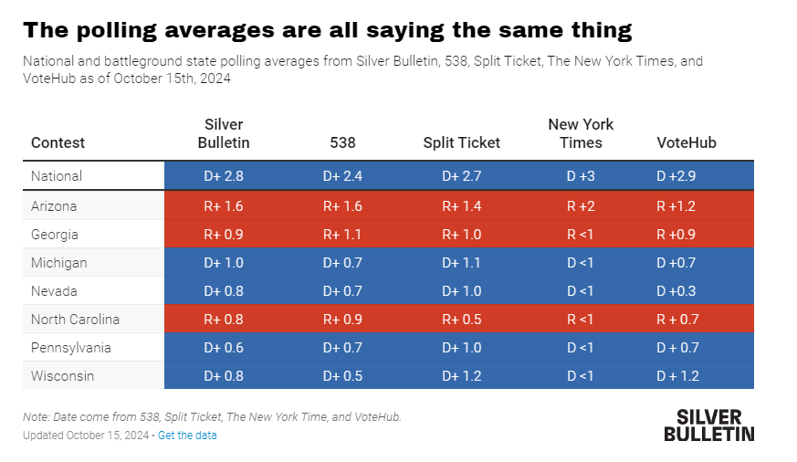

# 431 Class 16: 2024-10-17

[Main Website](https://thomaselove.github.io/431-2024/) | [Calendar](https://thomaselove.github.io/431-2024/calendar.html) | [Syllabus](https://thomaselove.github.io/431-syllabus-2024/) | [Text](https://thomaselove.github.io/431-book/) | [Contact Us](https://thomaselove.github.io/431-2024/contact.html) | [Canvas](https://canvas.case.edu) | [Data and Code](https://github.com/THOMASELOVE/431-data)
:-----------: | :--------------: | :----------: | :---------: | :-------------: | :-----------: | :------------:
for everything | for deadlines | expectations | from Dr. Love | get help | lab submission | for downloads

- Suggested [R/RStudio/Quatro learning resources](https://thomaselove.github.io/431-2024/resources.html)

## Today's Slides

Class | Date | Slides | Word .docx | Quarto .qmd | Recording
:---: | :--------: | :------: | :------: | :------: | :-------------:
16 | 2024-10-17 | **[Slides 16](https://thomaselove.github.io/431-slides-2024/class16.html)** | **[Word 16](https://thomaselove.github.io/431-slides-2024/class16w.docx)** | **[Code 16](https://github.com/THOMASELOVE/431-slides-2024/blob/main/class16.qmd)** | Visit [Canvas](https://canvas.case.edu/), select **Zoom** and **Cloud Recordings**

## Announcements

1. Lab 4 grades and feedback are posted to our Grading Roster in our Shared Google Drive folder.
2. Our next class (Class 17) will be Thursday 2024-10-24. It will be an "Ask Me Anything" / Project A Help Session conducted by Dr. Love over Zoom, rather than in person.
3. Class is cancelled on Tuesday 2024-10-22 and Office hours are canceled on Monday 2024-10-21 and Tuesday 2024-10-22. Enjoy your Fall Break.
4. Our next in-person class will be Class 18, on Tuesday 2024-10-29.

## Quiz 1 

- Most of the grades were in the A or B range, so that's great.
- Here is our advice to you about the Quiz...
    - If you didn't do as well as you'd like on the Quiz, go over the provided Answer Sketch (PDF) in our Shared Google Drive folder to see where you went wrong, and if you still don't understand something, ask us about it on Campuswire or in TA office hours. Then forget about the Quiz, and work on Project A.
    - If you did do as well as you'd like on the Quiz, great! Go over the provided Answer Sketch (PDF) in our Shared Google Drive folder to see where you went wrong, and if you still don't understand something, ask us about it on Campuswire or in TA office hours. Then forget about the Quiz, and work on Project A.

## One Last Thing

, from [Are Republican pollsters “flooding the zone?”](https://www.natesilver.net/p/are-republican-pollsters-flooding) by Eli McKown-Dawson at Silver Bulletin posted 2024-10-16.

## Come see me in Agatha Christie's "And Then There Were None"!

October 25 - November 16, 2024 on Fridays and Saturdays at 7:30 PM. Tickets and more information at <https://www.auroracommunitytheatre.com/>. My [theater page is here](https://github.com/THOMASELOVE/theater), if you're interested.

