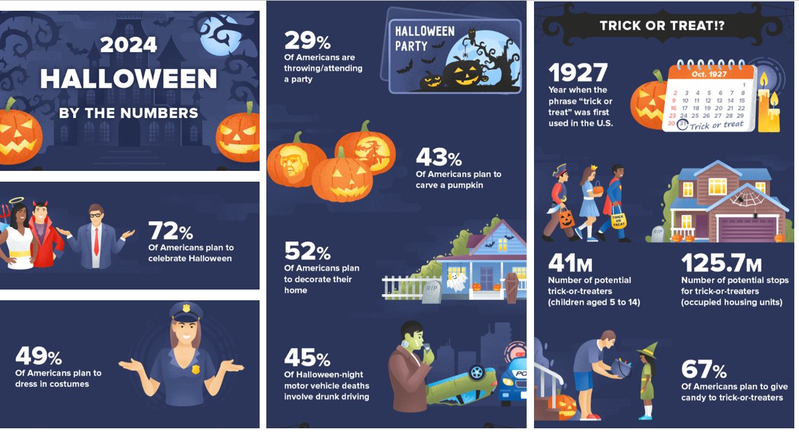
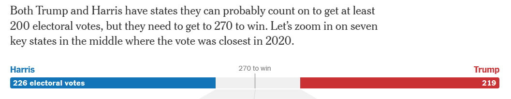
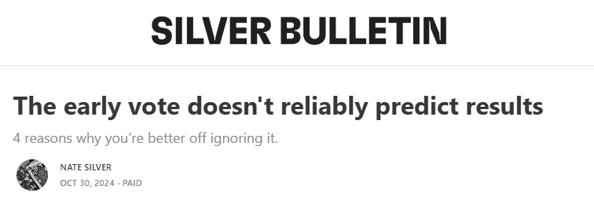
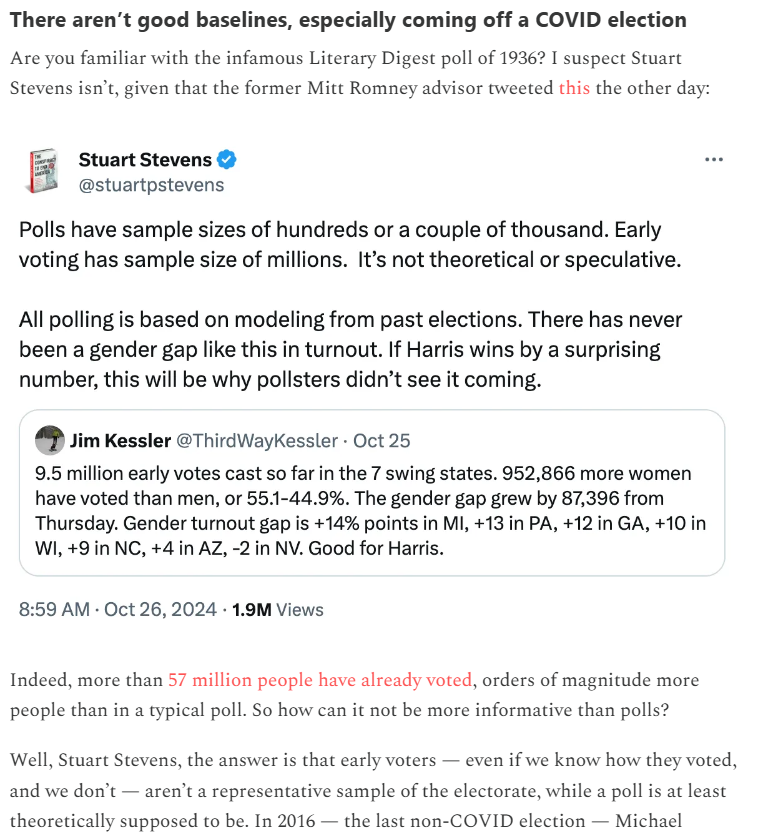
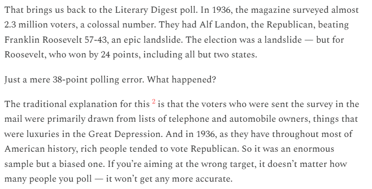

# 431 Class 19: 2024-10-31

[Main Website](https://thomaselove.github.io/431-2024/) | [Calendar](https://thomaselove.github.io/431-2024/calendar.html) | [Syllabus](https://thomaselove.github.io/431-syllabus-2024/) | [Text](https://thomaselove.github.io/431-book/) | [Contact Us](https://thomaselove.github.io/431-2024/contact.html) | [Canvas](https://canvas.case.edu) | [Data and Code](https://github.com/THOMASELOVE/431-data)
:-----------: | :--------------: | :----------: | :---------: | :-------------: | :-----------: | :------------:
for everything | for deadlines | expectations | from Dr. Love | get help | lab submission | for downloads

- Suggested [R/RStudio/Quatro learning resources](https://thomaselove.github.io/431-2024/resources.html)

## Today's Slides

Class | Date | Slides | Word .docx | Quarto .qmd | Recording
:---: | :--------: | :------: | :------: | :------: | :-------------:
19 | 2024-10-31 | **[Slides 19](https://thomaselove.github.io/431-slides-2024/class19.html)** | **[Word 19](https://thomaselove.github.io/431-slides-2024/class19w.docx)** | **[Code 19](https://github.com/THOMASELOVE/431-slides-2024/blob/main/class19.qmd)** | Visit [Canvas](https://canvas.case.edu/), select **Zoom** and **Cloud Recordings**

## Happy Halloween

- Excerpt from [Halloween Facts Infographic: Spooky Stats for 2024](https://wallethub.com/blog/halloween-facts/25374) by John S. Kiernan.

## Announcements

1. Feedback on the Minute Paper after Class 18 [is available here](https://bit.ly/431-2024-min-18-feedback).
2. Project A Portfolio Review Status [is available here](https://github.com/THOMASELOVE/431-classes-2024/blob/main/projectA/portfolio_review.md). Ignore any grades you see on [Canvas](https://canvas.case.edu/).
3. Today, we'll talk about [Project B](https://thomaselove.github.io/431-projectB-2024/) a bit, so you can get started as early as this weekend.
    - See the [Calendar](https://thomaselove.github.io/431-2024/calendar.html) for all Project B deadlines.
    - The [Project B Registration Form](https://bit.ly/431-projB-registration-2024) is available now at <https://bit.ly/431-projB-registration-2024>.
    - The [Project B Sample Report for Study 1](https://thomaselove.github.io/431-projectB-2024/study1c.html) and [Project B Sample Report for Study 2](https://thomaselove.github.io/431-projectB-2024/study2c.html) will go live before our next class on Thursday 2024-11-07.
4. I reposted [Lab 5](https://github.com/THOMASELOVE/431-labs-2024/tree/main/lab5) to make it clear that we want you to use **90%** confidence throughout. It is due next Wednesday 2024-11-06 at noon.
5. Remember that we don't have 431 class (but our TAs will hold office hours) next Tuesday 2024-11-05 (Election Day).

-------

## State of the Presidential Race

State | Electoral   Votes | [Silver Bulletin](https://www.natesilver.net/)   Pr(D wins) | [Silver Bulletin](https://www.natesilver.net/)   Polling Avg. | [538](https://projects.fivethirtyeight.com/2024-election-forecast)   Pr(D wins) | [538](https://projects.fivethirtyeight.com/2024-election-forecast)   Polling Avg. | [RealClearPolling](https://www.realclearpolling.com/)   Polling Avg. | [NY Times](https://www.nytimes.com/interactive/2024/us/elections/polls-president.html)   Polling Avg.
-----: | --: | -----: | -----: | -----: | -----: | -----: | -----:
Arizona | 11 | 28.7% | R +2.3 | 35% | R +2.0 | R +2.5 | R +3
Georgia | 16 | 33.2% | R +1.9 | 37% | R +1.2 | R +2.4 | R +2
Michigan | 15 | 59.2% | D +1.1 | 59% | D +1.1 | D +0.5 | D < +1
Nevada | 6 | 50.0% | D +0.1 | 51% | D +0.1 | R +0.5 | Even
North Carolina | 16 | 37.6% | R +1.1 | 40% | R +1.3 | R +1.0 | R < +1
Pennsylvania | 19 | 43.0% | R +0.6 | 47% | R +0.4 | R +0.8 | R +1
Wisconsin | 10 | 54.8% | D +0.7 | 56% | D +0.8 | D +0.2 | D +1

as of 2024-10-30. 

-----

From [FiveThirtyEight](https://abcnews.go.com/538/) "[Trump and Harris are both a normal polling error away from a blowout](https://abcnews.go.com/538/trump-harris-normal-polling-error-blowout)": 

Based on how much polls have been off in the past, **our election model estimates that the average polling error in competitive states this year will be 3.8 points on the margin** (see detail in bullet point below.) This error is not uniform across states — for example, states with different demographics tend to have [different levels of polling error](https://abcnews.go.com/538/states-accurate-polls/story?id=115108709) — but, generally speaking, when polls overestimate a candidate, they tend to overestimate them across the board. In other words, the model is expecting a roughly 2020-sized polling error — although not necessarily in the same direction as 2020. (In 50 percent of the model's simulations, Trump beats his polls, and 50 percent of the time, Harris does.) The direction of polling error is [impossible to predict in advance](https://fivethirtyeight.com/features/2022-election-polling-accuracy/).

This point is worth dwelling on. Because our average expectation is for there to be a decently large polling error at least half of the time, there is actually a very low probability that the polls are perfect and the election plays out exactly how the polls suggest. Let's look at this using the largest lead either candidate has in the seven swing states: Trump's current 2-point lead in Arizona. Nationwide, our model expects polling error to be greater than 2 points in either direction 62 percent of the time. In other words, there's only about a 1-in-3 chance that polls miss by less than 2 points (which we would consider a small polling error historically).

Given that all seven key swing states are so close, even small polling errors in the same direction can have a big impact on who wins the election. According to the simulations from our model, there is a 60-in-100 chance either candidate wins over 300 Electoral College votes — which Harris could do by winning five of the seven swing states and Trump six out of the seven.

* We simulate potential polling errors for future elections using a fat-tailed distribution — specifically, a Student's t distribution with five degrees of freedom (a parameter that increases or decreases the likelihood of surprise "tail" events in our simulations). [A] 3.8-point error is the spread, or sigma, of that distribution — analogous to the standard deviation of a normal distribution. 538's distributions are slightly wider than the ones used by other forecasting models. This is because our model accounts for the fact that polling misses have gotten bigger over the last decade.

In particular, pollsters are still reporting difficulty [reaching voters at all](https://x.com/UpshotNYT/status/1580188137359552512), and Trump supporters may still be less likely to respond to polls — [even high-quality ones](https://www.vox.com/2024-elections/370649/trust-polls-2016-2020-election-2024-pollster-polling-miss). This means that pollsters are as reliant as ever ([or maybe more](https://www.msnbc.com/opinion/msnbc-opinion/trump-harris-2024-election-polls-challenges-rcna176467)!) on weighting and modeling to get good estimates of public opinion. But the decisions they [make matter a lot](https://goodauthority.org/news/election-poll-vote2024-data-pollster-choices-weighting/), and in particular, there appear to be large differences between polls that try to use these techniques to [balance their samples by party or past vote and those that do not](https://goodauthority.org/news/pollsters-are-weighting-surveys-differently-in-2024/).

And this is the big, fundamental problem with preelection polling: We don't know what the demographic and political composition of the actual electorate will be, so pollsters are just making the best guesses they can. Those guesses have always, and will always, come with error attached to them.

As we enter the final week of this election, it is a good time to remember that uncertainty is an inherent part of polling and elections. That is especially true this year, with deadlocked races across the swing states. Given that polls are imperfect, our expectation is for them to be off by some amount in either direction. And if the polls do end up being off, given the closeness of the election, there is a rather wide spread in the range of Electoral College outcomes.

In other words, we can sum up the current state of the race like this: Although Trump and Harris have roughly equal chances of winning the election, the final margin is not necessarily going to be close. In fact, there's a pretty high probability that it won't be.

---

## On Early Voting Numbers (from [Silver Bulletin](https://www.natesilver.net/))

...

...

----

## One Last Thing

[The Ultimate Halloween Candy Power Ranking](https://fivethirtyeight.com/videos/the-ultimate-halloween-candy-power-ranking/) from FiveThirty Eight in 2017.

- Data available [on Github](https://github.com/fivethirtyeight/data/tree/master/candy-power-ranking)
- Check out the survey at [What's the best Halloween candy?](https://walthickey.com/2017/10/18/whats-the-best-halloween-candy/)
