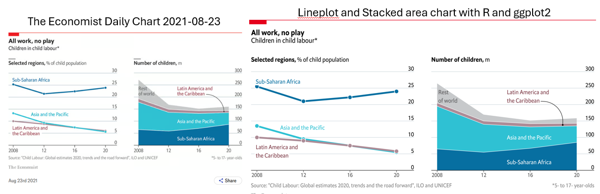
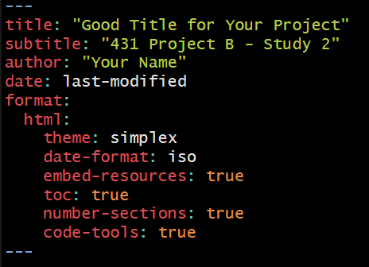
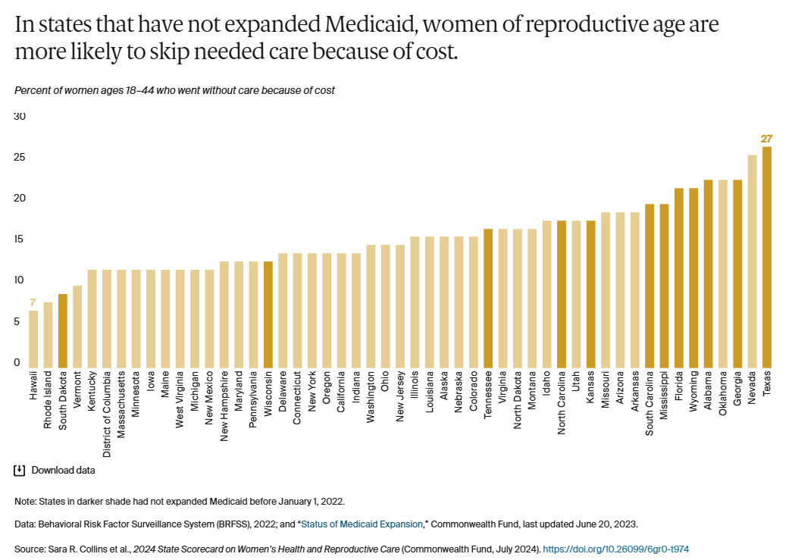

# 431 Class 24: 2024-11-21

[Main Website](https://thomaselove.github.io/431-2024/) | [Calendar](https://thomaselove.github.io/431-2024/calendar.html) | [Syllabus](https://thomaselove.github.io/431-syllabus-2024/) | [Text](https://thomaselove.github.io/431-book/) | [Contact Us](https://thomaselove.github.io/431-2024/contact.html) | [Canvas](https://canvas.case.edu) | [Data and Code](https://github.com/THOMASELOVE/431-data)
:-----------: | :--------------: | :----------: | :---------: | :-------------: | :-----------: | :------------:
for everything | for deadlines | expectations | from Dr. Love | get help | lab submission | for downloads

- Suggested [R/RStudio/Quarto learning resources](https://thomaselove.github.io/431-2024/resources.html)

## Today's Slides

Class | Date | Slides | Word .docx | Quarto .qmd | Recording
:---: | :--------: | :------: | :------: | :------: | :-------------:
24 | 2024-11-21 | **[Slides 24](https://thomaselove.github.io/431-slides-2024/class24.html)** | **[Word 24](https://thomaselove.github.io/431-slides-2024/class24w.docx)** | **[Code 24](https://github.com/THOMASELOVE/431-slides-2024/blob/main/class24.qmd)** | Visit [Canvas](https://canvas.case.edu/), select **Zoom** and **Cloud Recordings**

- From <https://r-graph-gallery.com/web-lineplots-and-area-chart-the-economist.html> which includes all of the R code to build this.
- The original chart appeared [here in The Economist](https://www.economist.com/graphic-detail/2021/08/23/the-number-of-child-labourers-has-increased-for-the-first-time-in-20-years) 2021-08-23.

## Announcements

1. Thanks to Dr. Love spraining his ankle on Tuesday, Class 24 will be given over Zoom. The link is in your email, and also on [Canvas](https://canvas.case.edu).
2. [Quiz 2](https://github.com/THOMASELOVE/431-quizzes-2024/tree/main/quiz2) will be provided to you after the session today, no later than 5 PM. It is due on Wednesday 2024-12-04 at Noon. Some initial materials [are available now](https://github.com/THOMASELOVE/431-quizzes-2024/tree/main/quiz2).
3. [Lab 7](https://github.com/THOMASELOVE/431-labs-2024/tree/main/lab7) (making your website) is also due on Wednesday 2024-12-04 at Noon.
    - Posit just released a series of four YouTube videos on Quarto websites: [Build your homepage](https://www.youtube.com/watch?v=l7r24gTEkEY), [Add pages and navigation](https://www.youtube.com/watch?v=k65E-8PXZmA), [Styling with CSS/SCSS](https://www.youtube.com/watch?v=pAN2Hiq0XGs), and [Add lists of content with listing](https://www.youtube.com/watch?v=bv_Cw-3HI1Y&list=PL9HYL-VRX0oTCvag75m8yDjFoJvE-gMxp&index=4).
5. The [Lab 6 answer sketch](https://github.com/THOMASELOVE/431-labs-2024/tree/main/lab6) is now available in our Shared Google Drive folder. Grades and feedback on Lab 6 should be in your hands by Tuesday 2024-12-03 (after Thanksgiving.)
6. From the [R Graph Gallery](https://r-graph-gallery.com/), some examples of [animation](https://r-graph-gallery.com/animation.html) and of [interactive charts](https://r-graph-gallery.com/interactive-charts.html). 
7. The short answer regarding 432 is that if you like what I did and what you did in 431, you'll like it. If you didn't, you probably won't.
8. Feedback on the Minute Paper after Class 23 is [now available](https://bit.ly/431-2024-min-23-feedback).

---

In today's class, we'll start by finishing up slides 43-54 from Class 23 (links below) before we move on to the Class 24 slides...

Class | Date | Slides | Word .docx | Quarto .qmd | Recording
:---: | :--------: | :------: | :------: | :------: | :-------------:
23 | 2024-11-19 | **[Slides 23](https://thomaselove.github.io/431-slides-2024/class23.html)** | **[Word 23](https://thomaselove.github.io/431-slides-2024/class23w.docx)** | **[Code 23](https://github.com/THOMASELOVE/431-slides-2024/blob/main/class23.qmd)** | Visit [Canvas](https://canvas.case.edu/), select **Zoom** and **Cloud Recordings**

-------

## Project B: Don't Forget the Basics

1. We don't want to see any messages or warnings in your R packages section. If you are going to continue to use R version 4.4.1, you will have to silence warnings as well as messages in your R setup section of your Project B.
2. Don't load any packages that are part of [the core tidyverse](https://www.tidyverse.org/packages/#core-tidyverse) separately, and don't load any of [the easystats packages](https://easystats.github.io/easystats/) separately. Load easystats next-to-last, and load tidyverse last.
3. Use # to create a section heading, ## to create a sub-section heading and ### to create a sub-sub-section heading. Don't use sub-sub-sub-sections.
4. Source `Love-431.R` in a way that is replicable. `source("Love-431.R")` or `source("data/Love-431.R")` are OK, as is identifying the `url` and sourcing that in, but what you cannot do is load the script by calling for a directory that no one else will have.
5. Be sure to set a theme for your ggplots as part of your R package section: I suggest either `theme_set(theme_bw())` or `theme_set(theme_lucid())`
6. Be sure to use `knitr:opts_chunk$set(comment=NA)` in your R package section.
7. When you submit to Canvas, be certain that both Study 1 and Study 2 are properly rendered and that the code is downloadable (by clicking the Code button, as displayed [here in the Study 1 sample report](https://thomaselove.github.io/431-projectB-2024/sample-study1.html), or [here in the Study 2 sample report](https://thomaselove.github.io/431-projectB-2024/sample-study2.html).)
8. Your YAML code should look something like this. In addition to changing the title, the subtitle, and the author, you may also want to change the html theme to another option. The [options for HTML themes are here](https://quarto.org/docs/output-formats/html-themes.html). Don't use 431, Project or Study 1 in your main title. That'll be covered by the subtitle.

-------

### Reminders: Thanksgiving Break

- I will not hold 431 class during Thanksgiving week, on either Tuesday 2024-11-26 or Thursday 2024-11-28. I will respond to questions posted to Campuswire (anything other than Quiz 2) or to my email (questions about Quiz 2) several times that week.
- [TA office hours](https://thomaselove.github.io/431-2024/contact.html) for 431 are cancelled from Saturday 2024-11-23 through Saturday 2024-11-30, and will resume Sunday 2024-12-01.

### After Today, Two Remaining 431 Classes

- The "Ask Me Anything" Zoom session with Dr. Love will be [Class 25](https://github.com/THOMASELOVE/431-classes-2024/tree/main/class25), on Tuesday 2024-12-03 (after Thanksgiving) at 1 PM. I'll email the Zoom link to you the day before (and it's already posted to [Canvas](https://canvas.case.edu), too.)
    - "Anything" here isn't really accurate. I will answer anything at all about Project B, or the course generally, but I won't use this forum to answer specific questions about Quiz 2, unless you can be really clever about it, so I don't realize that's what you're asking. For Quiz questions, you'll have to email me.
- Our final class (Class 26) will be held in person on Thursday 2024-12-05. It's my favorite session of 431 each year, in some important ways, and I'll discuss Quiz 2, Project B, what happens in 432, and the future more generally, and some "fun" stuff. There will be candy, thanks to Zuhair Khan.

### 431 Post-Thanksgiving Deadlines

- All three current "bonus opportunities" are due on Sunday 2024-12-01, or, technically, at 9 AM on Monday 2024-12-02.
- [Quiz 2](https://github.com/THOMASELOVE/431-quizzes-2024/tree/main/quiz2) **and** [Lab 7](https://github.com/THOMASELOVE/431-labs-2024/tree/main/lab7) are **both** due on Wednesday 2024-12-04 at noon. (Lab 7 cannot be "skipped".)
    - Congratulations to those of [you who have already completed Lab 7](https://github.com/THOMASELOVE/431-labs-2024/tree/main/lab7#new-completed-websites-by-students-in-this-years-class)!
- Everyone's [Project B presentation is scheduled](https://github.com/THOMASELOVE/431-classes-2024/blob/main/projectB/schedule.md) for December 6, 9, 10 or 11.
- All [Project B written materials](https://thomaselove.github.io/431-projectB-2024/checklist.html) are due on Wednesday 2024-12-11 at noon.

-------

## Two "Last Things"

[The United States of Abortion Mazes](https://pudding.cool/2024/10/abortion-mazes/)

----

From [2024 State Scorecard on Women’s Health and Reproductive Care](https://www.commonwealthfund.org/publications/scorecard/2024/jul/2024-state-scorecard-womens-health-and-reproductive-care) at [the Commonwealth Fund](https://www.commonwealthfund.org/).

