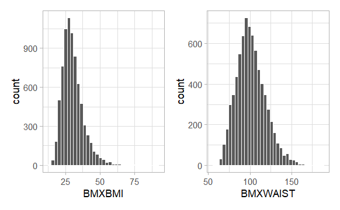
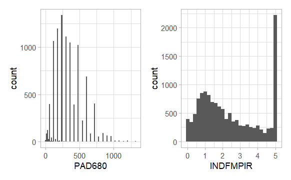

# Project B Registration Status

Unless otherwise indicated, all NHANES listings before refer exclusively to the [NHANES 2017 - March 2020 (Pre-Pandemic)](https://wwwn.cdc.gov/nchs/nhanes/continuousnhanes/default.aspx?Cycle=2017-2020) cycle. 

## Your Status

Each project is briefly summarized below, in a table.

- The "Approved?" column is **Yes** if I have approved your proposal. I don't need to hear from you again on Project B until your presentation. This is sometimes accompanied by a note below your details, and sometimes not, if everything looks OK so far. Just take my suggestions to heart and move forward to actually do Project B.
- If the "Approved?" column indicates **Not Yet**, check your email for a note from me sent 2024-11-13, and reply to that email as soon as you can with whatever changes you plan to make in light of my feedback. Thanks.

## Notes for All

1. If my listing of your project below is incorrect **in any detail**, please email me so I can fix it.
2. Do not categorize quantitative variables for Study 2 if you can possibly avoid it. It's much better to keep your information as granular as possible.
3. All values of Refused, Don't Know, Unsure, etc. should be converted by you into MISSING values, and should be imputed in Study 2, and filtered away in Study 1.
4. If your key Study 2 predictor is categorical, be sure that each category contains a substantial fraction (I would say at minimum 10%) of your available data. If not, you should collapse categories until it does.
5. **Note to myself**: In the instructions, I should have more actively discouraged people from using [Kaggle data sets](https://www.kaggle.com/datasets), especially those that have been pre-cleaned, and that have very limited amounts of information about how the study was designed or what the measures were. I think of these as teaching data sets.
 
## Notes for People Using NHANES data

1. I'll remind you that NHANES provides neither a random sample, nor a representative sample (at least without weights) of the American population, so do not claim that it is either of those things.
2. If you were not specific about it, I guessed that you were planning to work with adults between the ages of 21 and 79. If that is incorrect, please email me so I can fix it.
3. Those of you using Body Mass Index as an outcome or predictor, consider using [Waist Circumference](https://wwwn.cdc.gov/Nchs/Nhanes/2017-2018/P_BMX.htm#BMXWAIST) instead. Waist circumference is generally considered a better measure of health, as it indicates something meaningful about fat distribution. Here are the data in NHANES 2017-March 2020 for adults ages 21-79 for these two measures, and you can see that waist circumference is a little closer to Normally distributed here, too.

## Friday 2024-12-06

Group | Investigator(s) | Start | Data Source | S2 Outcome | S2 Key   Predictor | $n_{complete}$ | Approved?
:-----: | :-------------------------: | :-------: | :--------------------: | :-------: | :-------: | :-------: | :----: 
1 | Alexis Heath | 9:00 AM | [NHANES](https://wwwn.cdc.gov/nchs/nhanes/continuousnhanes/default.aspx?Cycle=2017-2020)   Adults ages 21-79 | Blood lead | Race/Ethnicity | 6995 | Yes
2 | Tatiana Dombrovski and Mahsa Sheikh | 9:25 AM | [NHANES](https://wwwn.cdc.gov/nchs/nhanes/continuousnhanes/default.aspx?Cycle=2017-2020)   Adults ages 21-79 | Fasting glucose | Serum Insulin | 3616 | Yes
3 | Nihit Mehta | 9:50 AM | [NHANES](https://wwwn.cdc.gov/nchs/nhanes/continuousnhanes/default.aspx?Cycle=2017-2020)   Adults ages 21-79 | Body mass index | Meal skipping (3 levels) | 2112 | Yes (see note)

- Nihit: Consider using waist circumference instead of BMI. See note at the top of the page.

Group | Investigator(s) | Start | Data Source | S2 Outcome | S2 Key   Predictor | $n_{complete}$ | Approved?
:-----: | :-------------------------: | :-------: | :--------------------: | :-------: | :-------: | :-------: | :----: 
4 | Atticus Kenny | 2:00 PM | [NHANES](https://wwwn.cdc.gov/nchs/nhanes/continuousnhanes/default.aspx?Cycle=2017-2020)   Adults ages 21-79 | Self-reported weight | Routine access to health care (Yes or No) | 1897 | Yes (see note)

- Atticus: I would be inclined to use actual measured weight (see [BMXWT](https://wwwn.cdc.gov/Nchs/Nhanes/2017-2018/P_BMX.htm#BMXWT)) as the outcome here, rather than self-reported weight.

Group | Investigator(s) | Start | Data Source | S2 Outcome | S2 Key   Predictor | $n_{complete}$ | Approved?
:-----: | :-------------------------: | :-------: | :--------------------: | :-------: | :-------: | :-------: | :----: 
5 | Graham Stockdale | 2:25 PM | [NHANES](https://wwwn.cdc.gov/nchs/nhanes/continuousnhanes/default.aspx?Cycle=2017-2020)   Adults ages 21-79 | Serum insulin | Triglyceride | 3330 | Yes
6 | Megan Zelinsky | 2:50 PM | [Cleveland Community Cat Project Outcomes Data Set](www.communitycatproject.org/data) | Length of stay in trap-neuter-rescue/return | Intake health status (6 levels) | 444 | Yes
7 | Paul Jones | 3:15 PM | [NHANES](https://wwwn.cdc.gov/nchs/nhanes/continuousnhanes/default.aspx?Cycle=2017-2020)   Adults ages 21-79 | Body mass index | Physical activity (3 levels) | 7474 | Yes (see note)

- Paul: I would stick with adults ages 21-79, instead of 21-75 (which is what you wrote in the form), unless you have a specific reason not to do so. Consider using waist circumference instead of BMI. See note at the top of the page.

Group | Investigator(s) | Start | Data Source | S2 Outcome | S2 Key   Predictor | $n_{complete}$ | Approved?
:-----: | :-------------------------: | :-------: | :--------------------: | :-------: | :-------: | :-------: | :----: 
8 | Brooke Bhattacharya and   Veda Machiraju | 3:40 PM | [NHANES](https://wwwn.cdc.gov/nchs/nhanes/continuousnhanes/default.aspx?Cycle=2017-2020)   Adults ages 21-79 | Total Cholesterol | Ever drank Alcohol (Yes or No) | 2056 | Yes (see note)

- Brooke and Veda: I don't love this key predictor, since you will have very few No responses. Instead of using ALQ111, I suggest you create a multi-categorical variable using [ALQ121](https://wwwn.cdc.gov/Nchs/Nhanes/2017-2018/P_ALQ.htm#ALQ121) which describes alcohol consumption over the past 12 months, which I would probably divide into four levels (code 0 vs. 1-4 vs. 5-7 vs. 8-10)

Group | Investigator(s) | Start | Data Source | S2 Outcome | S2 Key   Predictor | $n_{complete}$ | Approved?
:-----: | :-------------------------: | :-------: | :--------------------: | :-------: | :-------: | :-------: | :----: 
8.5 | Morgan McLoughlin | 4:05 PM | [Baby's First Year Study 2018-2022](https://www.childandfamilydataarchive.org/cfda/archives/cfda/studies/37871/datadocumentation#) | Sense of Parenting Competence | Depression (3 levels) | 918 | Yes (see note)

- Morgan: I am a bit concerned about your outcome, since it's a count variable, really, and has a fairly small number of possible values.  Using an outcome like this requires methods for regression on count outcomes that we won't get to until well into the 432 class, so I'm worried you'll get quite frustrated with the choice in this work. I guess we'll see what happens.

## Monday 2024-12-09

Group | Investigator(s) | Start | Data Source | S2 Outcome | S2 Key   Predictor | $n_{complete}$ | Approved?
:-----: | :-------------------------: | :-------: | :--------------------: | :-------: | :-------: | :-------: | :----: 
9 | Anika Krishna and Madaline Witort | 8:50 AM | [National Longitudinal Survey of Youth 1997](https://www.nlsinfo.org/content/cohorts/nlsy97/topical-guide)) | Years of Education | General Health (5 levels) | 5081 | Yes
10 | Saar Anis | 9:15 AM | [NHANES](https://wwwn.cdc.gov/nchs/nhanes/continuousnhanes/default.aspx?Cycle=2017-2020)   Adults ages 21-79 | Triglyceride | LDL Cholesterol | 4277 | Yes
11 | Aishwarya Deengar and Harshita Kumar | 9:45 AM |[NHANES](https://wwwn.cdc.gov/nchs/nhanes/continuousnhanes/default.aspx?Cycle=2017-2020)   Adults ages 21-79 | Waist Circumference | Blood Lead | 2516 | Yes 
12 | Dana Jian | 10:10 AM | [NHANES](https://wwwn.cdc.gov/nchs/nhanes/continuousnhanes/default.aspx?Cycle=2017-2020)   Adults ages 21-79 | Sedentary Minutes per day | Ratio of Family Income to Poverty | 6830 | Yes (see note)

- Dana: The distribution of [PAD680](https://wwwn.cdc.gov/Nchs/Nhanes/2017-2018/P_PAQ.htm#PAD680) (your outcome) is highly discrete, which may wind up being frustrating for you as an outcome. Also the key predictor has a very pronounced ceiling effect, enough that it, too, may make your life very complicated.
- On the left is a histogram of the sedentary minutes per day to make my point about its discreteness. More than 90% of the 9610 values available for that variable (after you get rid of the missingness and refused codes) are one of just 10 numbers: (60, 120, 180, 240, 300, 360, 420, 480, 600 or 720.) On the right, we see a histogram of the INDFMPIR variable. Note the enormous number of values at 5.

Group | Investigator(s) | Start | Data Source | S2 Outcome | S2 Key   Predictor | $n_{complete}$ | Approved?
:-----: | :-------------------------: | :-------: | :--------------------: | :-------: | :-------: | :-------: | :----: 
13 | Olivia Lindberg | 10:35 AM | [US Well-Being and Basic Needs Survey 2018](https://www.icpsr.umich.edu/web/ICPSR/studies/37653#) | Typical hours worked per week | Food insecurity (Yes or No) | 453 | **Not Yet** (see note)

- Olivia: Using an outcome like this (which is likely to have nearly all of the values be one of just a few values) isn't a good choice for a linear model. A problem with many surveys of this type is that they don't provide enough quantitative variables that actually describe a wide range of results to be useful for a linear regression project. Can you choose a better outcome?

Group | Investigator(s) | Start | Data Source | S2 Outcome | S2 Key   Predictor | $n_{complete}$ | Approved?
:-----: | :-------------------------: | :-------: | :--------------------: | :-------: | :-------: | :-------: | :----: 
14 | Nick Nazak and Rebecca Stinson | 11:00 AM | [HDHI Admissions from Kaggle](https://www.kaggle.com/datasets/ashishsahani/hospital-admissions-data) | Length of Stay in Hospital | Blood hemoglobin (3 levels) | 7789 | **Not Yet** (see note)

- Nick and Rebecca: While I'm not a big fan of many Kaggle data sets, this one is at least semi-reasonably documented so it might be OK. But you cannot use length of stay as an outcome (it is a censored survival outcome; a time-to-event variable, and those require tools we'll see in 432), and there's no sense in categorizing the hemoglobin levels into categories like this in your key predictor - if the data are available as a quantity, use them as a quantity. You will need to figure out what to do about the same individual having multiple "admissions" in these data. I would prefer your unit to be an individual, rather than an admission, so you'll probably wind up using the first admission for each subject with multiple admissions, which will reduce the sample size, I assume. 

Group | Investigator(s) | Start | Data Source | S2 Outcome | S2 Key   Predictor | $n_{complete}$ | Approved?
:-----: | :-------------------------: | :-------: | :--------------------: | :-------: | :-------: | :-------: | :----: 
15 | JiaWei Yu | 11:25 AM | [NHANES](https://wwwn.cdc.gov/nchs/nhanes/continuousnhanes/default.aspx?Cycle=2017-2020)   Adults ages 21-79 | Hours of Sleep on Workdays | Vigorous Recreation? (Yes or No) | 6623 | Yes (see note)

- JiaWei: Your outcome variable is a bit of a problem, because the data are very discrete, with only about 25 different values, of which 45% (roughly) are either 7, 8 or 9. Sleeping hours is a fine predictor, but I want to warn you that it may wind up being frustrating for you as an outcome.

Group | Investigator(s) | Start | Data Source | S2 Outcome | S2 Key   Predictor | $n_{complete}$ | Approved?
:-----: | :-------------------------: | :-------: | :--------------------: | :-------: | :-------: | :-------: | :----: 
16 | Katherine Papahadjoulos | 11:50 AM | [National Surveys on Drug Use and Health (NSDUH)](https://www.samhsa.gov/data/data-we-collect/nsduh/datafiles) | Psychological Distress Scale (0-24) | Substance use severity (4 levels) | 9299 | Yes (see note)

- Katherine: I am a little concerned about your outcome, since it's a count (of points) and can only have 25 possible values, and I expect the values to be highly right skewed with some very commonly chosen values. If you really do have complete data on all Study 2 variables (not just the outcome and key predictor), then take a random sample of 5000 people and use that instead.

Group | Investigator(s) | Start | Data Source | S2 Outcome | S2 Key   Predictor | $n_{complete}$ | Approved?
:-----: | :-------------------------: | :-------: | :--------------------: | :-------: | :-------: | :-------: | :----: 
17 | Feriel Presswalla and Alayna Rowell | 12:15 PM | [Health and Retirement Study (HRS) 2022 Core](https://hrsdata.isr.umich.edu/data-products/2022-hrs-core) individuals in pain | Most ever weighed | Degree of Pain (3 levels) | 633 | Yes
18 | Gina Lin | 12:40 PM | [NHANES](https://wwwn.cdc.gov/nchs/nhanes/continuousnhanes/default.aspx?Cycle=2017-2020)   Adults ages 21-79 **with a diabetes diagnosis** | Diastolic blood pressure | Age when first told you had diabetes | 1433 | Yes (see note)

- Gina: use the actually measured diastolic blood pressure in [the P_BPXO data](https://wwwn.cdc.gov/Nchs/Nhanes/2017-2018/P_BPXO.htm) (variable BPXODI1 would be fine) instead of the questionnaire version as your Study 2 outcome. The Age variable is a problem here because if you are 30 years old, you cannot have an age when first told you had diabetes above 30, but if you are 60 years old, you can. You may want instead to look at years since diagnosis by subtracting this key predictor from the subject's age, although that too is problematic.

Group | Investigator(s) | Start | Data Source | S2 Outcome | S2 Key   Predictor | $n_{complete}$ | Approved?
:-----: | :-------------------------: | :-------: | :--------------------: | :-------: | :-------: | :-------: | :----: 
19 | Spancer Zhou | 1:05 PM | [NHANES](https://wwwn.cdc.gov/nchs/nhanes/continuousnhanes/default.aspx?Cycle=2017-2020)   Adults ages 21-79 | PHQ-9 Depression Scale | BP < 130/800 for all three readings (Yes or No) | 6112 | Yes
20 | Jeff Lambe and   Tatchaporn Ongphichetmetha | 1:50 PM | [NHANES](https://wwwn.cdc.gov/nchs/nhanes/continuousnhanes/default.aspx?Cycle=2017-2020)   Adults ages 21-79 | LDL Cholesterol | Food Security (4 levels) | 3068 | Yes
21 | Debbie Seifert | 2:15 PM | [NHANES](https://wwwn.cdc.gov/nchs/nhanes/continuousnhanes/default.aspx?Cycle=2017-2020)   Adults ages 21-79 | Hours of Sleep on Workdays | Snoring (4 levels) | 7255 | Yes (see note)

- Debbie: Your outcome variable is a bit of a problem, because the data are very discrete, with only about 25 different values, of which 45% (roughly) are either 7, 8 or 9. Sleeping hours is a fine predictor, but I want to warn you that it may wind up being frustrating for you as an outcome.

Group | Investigator(s) | Start | Data Source | S2 Outcome | S2 Key   Predictor | $n_{complete}$ | Approved?
:-----: | :-------------------------: | :-------: | :--------------------: | :-------: | :-------: | :-------: | :----: 
22 | Sarah Cooke | 2:45 PM | [NHANES](https://wwwn.cdc.gov/nchs/nhanes/continuousnhanes/default.aspx?Cycle=2017-2020)   Adults ages 21-79 | Total cholesterol | Body mass index | 7197 | Yes (see note)

- Sarah: See my note at the top of this page about BMI vs. Waist Circumference.

Group | Investigator(s) | Start | Data Source | S2 Outcome | S2 Key   Predictor | $n_{complete}$ | Approved?
:-----: | :-------------------------: | :-------: | :--------------------: | :-------: | :-------: | :-------: | :----: 
23 | Mohammad Nasirpour | 3:10 PM | [NHANES](https://wwwn.cdc.gov/nchs/nhanes/continuousnhanes/default.aspx?Cycle=2017-2020)   Adults ages 21-79 | Body mass index | 1st Systolic BP | 7029 | Yes (see note)

- Mohammad: See my note at the top of this page about BMI vs. Waist Circumference.

Group | Investigator(s) | Start | Data Source | S2 Outcome | S2 Key   Predictor | $n_{complete}$ | Approved?
:-----: | :-------------------------: | :-------: | :--------------------: | :-------: | :-------: | :-------: | :----: 
24 | Ajay Mahenthiran | 3:35 PM | [NHANES](https://wwwn.cdc.gov/nchs/nhanes/continuousnhanes/default.aspx?Cycle=2017-2020)   Adults ages 21-79 **who smoke cigarettes** | Cigarettes/day | Health (5 levels) | 1687 | Yes (see note)

- Ajay: I am a little concerned about your outcome, since it's a count (of cigarettes), really, and I expect the values to be highly right skewed with some very commonly chosen values. 

Group | Investigator(s) | Start | Data Source | S2 Outcome | S2 Key   Predictor | $n_{complete}$ | Approved?
:-----: | :-------------------------: | :-------: | :--------------------: | :-------: | :-------: | :-------: | :----: 
25 | Shraddha Dumawat | 4:00 PM | [NHANES](https://wwwn.cdc.gov/nchs/nhanes/continuousnhanes/default.aspx?Cycle=2017-2020)   Adult **females** ages 21-79 | Iron Binding Capacity | Marital Status (3 levels) | 1741 | Yes (see note)

- Shraddha: You'll need to collapse the marital status options into 3 justifiable groups. Be sure each of those groups contains at least 10% of your data.

Group | Investigator(s) | Start | Data Source | S2 Outcome | S2 Key   Predictor | $n_{complete}$ | Approved?
:-----: | :-------------------------: | :-------: | :--------------------: | :-------: | :-------: | :-------: | :----: 
26 | Kelly Bowen | 4:25 PM | [NHANES](https://wwwn.cdc.gov/nchs/nhanes/continuousnhanes/default.aspx?Cycle=2017-2020)   Adults ages 21-79 | Median Liver Stiffness | Waist Circumference | 2878 | Yes (see note)

- Kelly: I assume you meant waist circumference as the key predictor, as indicated here. Stick to ages 21-79 unless you have a reason not to do so, though, even though your sample size may fall.

## Tuesday 2024-12-10

Group | Investigator(s) | Start | Data Source | S2 Outcome | S2 Key   Predictor | $n_{complete}$ | Approved?
:-----: | :-------------------------: | :-------: | :--------------------: | :-------: | :-------: | :-------: | :----: 
27 | Zuhair Khan | 10:35 AM | [NHANES](https://wwwn.cdc.gov/nchs/nhanes/continuousnhanes/default.aspx?Cycle=2017-2020)   Adults ages 21-79 | Body Mass Index | Average Hours of Sleep (Workdays) | 2388 | Yes (see note)

- Zuhair: Consider using waist circumference instead of BMI. See note at the top of the page. Be sure to use Average hours of sleep on workdays [variable SLD012](https://wwwn.cdc.gov/Nchs/Nhanes/2017-2018/P_SLQ.htm#SLD012), **without** categorizing it, as your key predictor.

Group | Investigator(s) | Start | Data Source | S2 Outcome | S2 Key   Predictor | $n_{complete}$ | Approved?
:-----: | :-------------------------: | :-------: | :--------------------: | :-------: | :-------: | :-------: | :----: 
28 | Haley Altadonna | 11:00 AM | [(BRFSS) Behavioral Risk Factor Surveillance System 2023](https://www.cdc.gov/brfss/annual_data/annual_2023.html) | Poor Physical Health in past 30d | Physical Activity (4 levels) | 6980 | Yes
29 | Brooke Jurasius | 11:25 AM | [NHANES](https://wwwn.cdc.gov/nchs/nhanes/continuousnhanes/default.aspx?Cycle=2017-2020)   Adults ages 21-79 | 1st Systolic Blood Pressure | Total Cholesterol | 6632 | Yes
30 | Rachel Liu | 11:50 AM | [NHANES](https://wwwn.cdc.gov/nchs/nhanes/continuousnhanes/default.aspx?Cycle=2017-2020)   Adults ages 21-79 | Urine arsenic level | Fatigue (4 categories) | 2699 | Yes
31 | Cassandra Lopez and Guanyu Wei | 12:15 PM | [NHANES](https://wwwn.cdc.gov/nchs/nhanes/continuousnhanes/default.aspx?Cycle=2017-2020)   Adults ages 21-79 | Waist Circumference | Moderate Recreation Minutes/Day | 2820 | Yes
32 | Dali Nemecio | 12:40 PM | [NHANES](https://wwwn.cdc.gov/nchs/nhanes/continuousnhanes/default.aspx?Cycle=2017-2020)   Adults ages 21-79 | Blood lead | Poverty level category (3 levels) | 9268 | Yes (see note)

- Dali: You have not filtered the NHANES data set properly to restrict yourself to adults ages 21-79 and to those with complete data on all of your predictors and outcome to get a sample size like this. It should be substantially smaller.

Group | Investigator(s) | Start | Data Source | S2 Outcome | S2 Key   Predictor | $n_{complete}$ | Approved?
:-----: | :-------------------------: | :-------: | :--------------------: | :-------: | :-------: | :-------: | :----: 
33 | Arya Patel | 1:05 PM | [NHANES](https://wwwn.cdc.gov/nchs/nhanes/continuousnhanes/default.aspx?Cycle=2017-2020)   Adults ages 21-79 | LDL Cholesterol | Minutes of Moderate Recreation | 3281 | Yes 
34 | Sonny Caradonna | 1:30 PM | [TBI Model Systems (TBIMS) National Database (NDB)](https://www.tbindsc.org/Researchers.aspx) | Cognitive Ability Scale | Ever hospitalized for a psychiatric problem? (Yes or No) | 10000 | Yes (see note)

- Sonny: This is fine, so long as you have a reasonable number of people (at least 10% of your sample) with Yes and with No on your key predictor. If you really do have complete data on all Study 2 variables (not just the outcome and key predictor), then take a random sample of 5000 people and use that instead. 

Group | Investigator(s) | Start | Data Source | S2 Outcome | S2 Key   Predictor | $n_{complete}$ | Approved?
:-----: | :-------------------------: | :-------: | :--------------------: | :-------: | :-------: | :-------: | :----: 
35 | Leia George | 1:55 PM | [Stress Analysis in Social Media from Kaggle](https://www.kaggle.com/datasets/ruchi798/stress-analysis-in-social-media) | negative emotion word % | subreddit domain (5 levels) | 2838 | Yes 
36 | Reilly Burhanna and Jose Diz Ferre | 2:10 PM | [NHANES](https://wwwn.cdc.gov/nchs/nhanes/continuousnhanes/default.aspx?Cycle=2017-2020)   Adults **who drink alcohol** ages 21-79 | Alcoholic drinks per day | Depression Status (4 levels) | 5863 | **Not Yet** (see note)

- Reilly and Jose: you need a new outcome and maybe a new predictor. This one only has values between 1 and 13, so you'd have to restrict yourself to those who drink alcohol, unless you plan to combine this variable (ALQ130) with ALQ121 somehow to include the people at zero. Even if you did that, using a count as an outcome like this (which is likely to have many, many more 0, 1, and 2 values than anything else and also has only 14 possible values) requires methods for regression on count outcomes that we won't get to until well into the 432 class. Pick a new outcome. You also need a new key predictor, unless you're planning to create a binary variable for your chosen depression variable ([DPQ020](https://wwwn.cdc.gov/Nchs/Nhanes/2017-2018/P_DPQ.htm#DPQ020)) because not at all and "everything other than not at all" are the only categories you could use there that would work as a key predictor.

Group | Investigator(s) | Start | Data Source | S2 Outcome | S2 Key   Predictor | $n_{complete}$ | Approved?
:-----: | :-------------------------: | :-------: | :--------------------: | :-------: | :-------: | :-------: | :----: 
37 | Toni Shoyinka and Isaac Zeng | 2:45 PM | [NHANES](https://wwwn.cdc.gov/nchs/nhanes/continuousnhanes/default.aspx?Cycle=2017-2020)   Adults ages 21-79 | Insulin level | Taking low-dose aspirin (3 levels) | 2555 | Yes (see note)

- Toni and Isaac: Shouldn't your sample be restricted to adults who have some reason to get their insulin checked (perhaps they have a diabetes diagnosis) and some reason to take a low-dose aspirin? So you should probably revise your description of the data sample. Also, you should only use a 3-category key predictor if all 3 levels have at least 10% of subjects in them.

Group | Investigator(s) | Start | Data Source | S2 Outcome | S2 Key   Predictor | $n_{complete}$ | Approved?
:-----: | :-------------------------: | :-------: | :--------------------: | :-------: | :-------: | :-------: | :----: 
38 | Derek Host | 3:10 PM  | [NHANES](https://wwwn.cdc.gov/nchs/nhanes/continuousnhanes/default.aspx?Cycle=2017-2020)   Adults ages 21-79 | Body mass index | Days/week of Physical Work | 556 | Yes (see note)

- Derek: Instead of using this key predictor (PAQ610), please use measure [PAQ605](https://wwwn.cdc.gov/Nchs/Nhanes/2017-2018/P_PAQ.htm#PAQ605) instead, which is just yes or no, but is answered by almost everyone, so you can get your sample size back up to a reasonable level for NHANES work. In addition, consider using waist circumference instead of BMI as your outcome. See note at the top of the page.

Group | Investigator(s) | Start | Data Source | S2 Outcome | S2 Key   Predictor | $n_{complete}$ | Approved?
:-----: | :-------------------------: | :-------: | :--------------------: | :-------: | :-------: | :-------: | :----: 
39 | Tom Kupferer | 3:35 PM | [NHANES](https://wwwn.cdc.gov/nchs/nhanes/continuousnhanes/default.aspx?Cycle=2017-2020)   Adults ages 21-79 | Total Cholesterol | PHQ-9 Depression Score | 4816 | Yes

## Wednesday 2024-12-11

Group | Investigator(s) | Start | Data Source | S2 Outcome | S2 Key   Predictor | $n_{complete}$ | Approved?
:-----: | :-------------------------: | :-------: | :--------------------: | :-------: | :-------: | :-------: | :----: 
40 | Weiyun Liang | 10:30 AM | [NHANES](https://wwwn.cdc.gov/nchs/nhanes/continuousnhanes/default.aspx?Cycle=2017-2020)   Adults ages 21-79 | 3rd Systolic Blood Pressure | LDL Cholesterol | 4617 | Yes
41 | Carly DaCosta and Gabrielle Davis | 10:55 AM | [NHANES](https://wwwn.cdc.gov/nchs/nhanes/continuousnhanes/default.aspx?Cycle=2017-2020)   Adults ages 21-79 | Hemoglobin level | Race/Ethnicity (5 levels) | 4291 | Yes 

## As Yet Unscheduled

- Monica Ghosh
