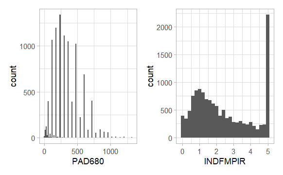

# Project B Registration Status

Unless otherwise indicated, all NHANES listings before refer exclusively to the [NHANES 2017 - March 2020 (Pre-Pandemic)](https://wwwn.cdc.gov/nchs/nhanes/continuousnhanes/default.aspx?Cycle=2017-2020) cycle. 

## Notes for All

1. If my listing of your project below is incorrect **in any detail**, please email me so I can fix it.
2. If your key Study 2 predictor is categorical, be sure that each category contains a substantial fraction (I would say at minimum 10%) of your available data. If not, you should collapse until it does.
 
## Notes for People Using NHANES data

1. I'll remind you that NHANES provides neither a random sample, nor a representative sample (at least without weights) of the American population, so do not claim that it is either of those things.
2. Those of you using Body Mass Index as an outcome or a predictor, consider using [Waist Circumference](https://wwwn.cdc.gov/Nchs/Nhanes/2017-2018/P_BMX.htm#BMXWAIST) instead.
3. If you were not specific, I guessed that you were planning to work with adults between the ages of 21 and 79. If that is incorrect, please email me so I can fix it.

## Friday 2024-12-06

Group | Investigator(s) | Start | Data Source | S2 Outcome | S2 Key   Predictor | $n_{complete}$ | Approved?
:-----: | :-------------------------: | :-------: | :--------------------: | :-------: | :-------: | -------: | :----: 
1 | Alexis Heath | 9:00 AM | [NHANES](https://wwwn.cdc.gov/nchs/nhanes/continuousnhanes/default.aspx?Cycle=2017-2020)   Adults ages 21-79 | Blood lead | Race/Ethnicity | 6995 | Yes
2 | Tatiana Dombrovski and Mahsa Sheikh | 9:25 AM | [NHANES](https://wwwn.cdc.gov/nchs/nhanes/continuousnhanes/default.aspx?Cycle=2017-2020)   Adults ages 21-79 | Fasting glucose | Serum Insulin | 3616 | Yes
3 | Nihit Mehta | 9:50 AM | [NHANES](https://wwwn.cdc.gov/nchs/nhanes/continuousnhanes/default.aspx?Cycle=2017-2020)   Adults ages 21-79 | Body mass index | Meal skipping (3 levels) | 2112 | Yes
4 | Atticus Kenny | 2:00 PM | [NHANES](https://wwwn.cdc.gov/nchs/nhanes/continuousnhanes/default.aspx?Cycle=2017-2020)   Adults ages 21-79 | Self-reported weight | Routine access to health care (Yes or No) | 1897 | Yes
5 | Graham Stockdale | 2:25 PM | [NHANES](https://wwwn.cdc.gov/nchs/nhanes/continuousnhanes/default.aspx?Cycle=2017-2020)   Adults ages 21-79 | Serum insulin | Triglyceride | 3330 | Yes
6 | Megan Zelinsky | 2:50 PM | [Cleveland Community Cat Project Outcomes Data Set](www.communitycatproject.org/data) | Length of stay in trap-neuter-rescue/return | Intake health status (6 levels) | 444 | Yes
7 | Paul Jones | 3:15 PM | [NHANES](https://wwwn.cdc.gov/nchs/nhanes/continuousnhanes/default.aspx?Cycle=2017-2020)   Adults ages 21-79 | Body mass index | Physical activity (3 levels) | 7474 | Yes (see note)

- Paul: I would stick with adults ages 21-79, instead of 21-75, unless you have a specific reason not to do so.

Group | Investigator(s) | Start | Data Source | S2 Outcome | S2 Key   Predictor | $n_{complete}$ | Approved?
:-----: | :-------------------------: | :-------: | :--------------------: | :-------: | :-------: | -------: | :----: 
8 | Brooke Bhattacharya and   Veda Machiraju | 3:40 PM | [NHANES](https://wwwn.cdc.gov/nchs/nhanes/continuousnhanes/default.aspx?Cycle=2017-2020)   Adults ages 21-79 | Total Cholesterol | Ever drank Alcohol (Yes or No) | 2056 | Yes (see note)

- Brooke and Veda: I don't love this key predictor, since you will have very few No responses. Instead of using ALQ111, I suggest you create a multi-categorical variable using [ALQ121](https://wwwn.cdc.gov/Nchs/Nhanes/2017-2018/P_ALQ.htm#ALQ121)) which describes alcohol consumption over the past 12 months, which I would probably divide into four levels (code 0 vs. 1-4 vs. 5-7 vs. 8-10)

## Monday 2024-12-09

Group | Investigator(s) | Start | Data Source | S2 Outcome | S2 Key   Predictor | $n_{complete}$ | Approved?
:-----: | :-------------------------: | :-------: | :--------------------: | :-------: | :-------: | -------: | :----: 
9 | Anika Krishna and Madaline Witort | 8:50 AM | National Longitudinal   [Survey of Youth 1997](https://www.nlsinfo.org/content/cohorts/nlsy97/topical-guide)) | Total # of Arrests | General Health (5 levels) | 5081 | Not Yet (see note)

- Anika and Madaline: Using a count as an outcome like this (which is likely to have many, many more 0 values than anything else) requires methods for regression on count outcomes that we won't get to until well into the 432 class. A problem with many surveys of this type is that they don't provide enough quantitative variables to be useful for a linear regression project. Can you choose a better outcome?

Group | Investigator(s) | Start | Data Source | S2 Outcome | S2 Key   Predictor | $n_{complete}$ | Approved?
:-----: | :-------------------------: | :-------: | :--------------------: | :-------: | :-------: | -------: | :----: 
10 | Saar Anis | 9:15 AM | [NHANES](https://wwwn.cdc.gov/nchs/nhanes/continuousnhanes/default.aspx?Cycle=2017-2020)   Adults ages 21-79 | Triglyceride | LDL Cholesterol | 4277 | OK
11 | Aishwarya Deengar and Harshita Kumar | 9:45 AM |[NHANES](https://wwwn.cdc.gov/nchs/nhanes/continuousnhanes/default.aspx?Cycle=2017-2020)   Adults ages 21-79 | Body mass index | Urine Lead level | 2516 | Not Yet (see note)

- Aishwarya and Harshita: Those of you using Body Mass Index as an outcome or a predictor, consider using [Waist Circumference](https://wwwn.cdc.gov/Nchs/Nhanes/2017-2018/P_BMX.htm#BMXWAIST) instead. Not sure why you'd use lead levels from urine (URXUPB) (which I think is only available as a limited access data set anyway) instead of serum lead levels, as in [variable LBXBPB](https://wwwn.cdc.gov/Nchs/Nhanes/2017-2018/P_PBCD.htm#LBXBPB).

Group | Investigator(s) | Start | Data Source | S2 Outcome | S2 Key   Predictor | $n_{complete}$ | Approved?
:-----: | :-------------------------: | :-------: | :--------------------: | :-------: | :-------: | -------: | :----: 
12 | Dana Jian | 10:10 AM | [NHANES](https://wwwn.cdc.gov/nchs/nhanes/continuousnhanes/default.aspx?Cycle=2017-2020)   Adults ages 21-79 | Minutes Sedentary per day | Ratio of Family Income to Poverty | 6830 | Not Yet (see note)

- Dana: I am worried that the distribution of [PAD680](https://wwwn.cdc.gov/Nchs/Nhanes/2017-2018/P_PAQ.htm#PAD680) (your outcome) will be highly discrete, which will wind up being more than a little frustrating for you as an outcome, although it's a fine predictor choice. In addition, can you please also select a different key predictor? The INDFMPIR variable has a very pronounced ceiling effect. It's OK to use it as one of your predictors, but don't make it the key one. Here's a histogram of the sedentary minutes per day to make my point about its discreteness. More than 70% of the 9610 values available for that variable (after you get rid of the missingness and refused codes) are either 120, 180, 240, 300, 360 or 480, and if you add in 60, 420, 600 and 720 you have now covered more than 90% of the observations.

Group | Investigator(s) | Start | Data Source | S2 Outcome | S2 Key   Predictor | $n_{complete}$ | Approved?
:-----: | :-------------------------: | :-------: | :--------------------: | :-------: | :-------: | -------: | :----: 
13 | Olivia Lindberg | 10:35 AM | US Well-Being and   [Basic Needs Survey 2018](https://www.icpsr.umich.edu/web/ICPSR/studies/37653#) |
14 | Nick Nazak and Rebecca Stinson | 11:00 AM | HDHI Admissions   [from Kaggle](https://www.kaggle.com/datasets/ashishsahani/hospital-admissions-data?resource=download) | 
15 | JiaWei Yu | 11:25 AM | [NHANES](https://wwwn.cdc.gov/nchs/nhanes/continuousnhanes/default.aspx?Cycle=2017-2020)  
16 | Katherine Papahadjoulos | 11:50 AM | National Surveys on   [Drug Use and Health (NSDUH)](https://www.samhsa.gov/data/data-we-collect/nsduh/datafiles)
17 | Feriel Presswalla and Alayna Rowell | 12:15 PM | Health and Retirement Study   [(HRS) 2022 Core](https://hrsdata.isr.umich.edu/data-products/2022-hrs-core)
18 | Gina Lin | 12:40 PM | [NHANES](https://wwwn.cdc.gov/nchs/nhanes/continuousnhanes/default.aspx?Cycle=2017-2020)  
19 | Spancer Zhou | 1:05 PM | [NHANES](https://wwwn.cdc.gov/nchs/nhanes/continuousnhanes/default.aspx?Cycle=2017-2020)  
20 | Jeff Lambe and   Tatchaporn Ongphichetmetha | 1:50 PM | [NHANES](https://wwwn.cdc.gov/nchs/nhanes/continuousnhanes/default.aspx?Cycle=2017-2020)  
21 | Debbie Seifert | 2:15 PM | [NHANES](https://wwwn.cdc.gov/nchs/nhanes/continuousnhanes/default.aspx?Cycle=2017-2020)  
22 | Sarah Cooke | 2:45 PM | [NHANES](https://wwwn.cdc.gov/nchs/nhanes/continuousnhanes/default.aspx?Cycle=2017-2020)  
23 | Mohammad Nasirpour | 3:10 PM | [NHANES](https://wwwn.cdc.gov/nchs/nhanes/continuousnhanes/default.aspx?Cycle=2017-2020)  
24 | Ajay Mahenthiran | 3:35 PM | [NHANES](https://wwwn.cdc.gov/nchs/nhanes/continuousnhanes/default.aspx?Cycle=2017-2020)  
25 | Shraddha Dumawat | 4:00 PM | [NHANES](https://wwwn.cdc.gov/nchs/nhanes/continuousnhanes/default.aspx?Cycle=2017-2020)  
26 | Kelly Bowen | 4:25 PM | [NHANES](https://wwwn.cdc.gov/nchs/nhanes/continuousnhanes/default.aspx?Cycle=2017-2020)  

## Tuesday 2024-12-10

Group | Investigator(s) | Start | Data Source | S2 Outcome | S2 Key   Predictor | $n_{complete}$ | Approved?
:-----: | :-------------------------: | :-------: | :--------------------: | :-------: | :-------: | -------: | :----: 
27 | Zuhair Khan | 10:35 AM | [NHANES](https://wwwn.cdc.gov/nchs/nhanes/continuousnhanes/default.aspx?Cycle=2017-2020)  
28 | Haley Altadonna | 11:00 AM | (BRFSS) Behavioral Risk Factor   [Surveillance System 2023](https://www.cdc.gov/brfss/annual_data/annual_2023.html) |
29 | Brooke Jurasius | 11:25 AM | [NHANES](https://wwwn.cdc.gov/nchs/nhanes/continuousnhanes/default.aspx?Cycle=2017-2020)  
30 | Rachel Liu | 11:50 AM | [NHANES](https://wwwn.cdc.gov/nchs/nhanes/continuousnhanes/default.aspx?Cycle=2017-2020)  
31 | Cassandra Lopez and Guanyu Wei | 12:15 PM | [NHANES](https://wwwn.cdc.gov/nchs/nhanes/continuousnhanes/default.aspx?Cycle=2017-2020)  
32 | Dali Nemecio | 12:40 PM | [NHANES](https://wwwn.cdc.gov/nchs/nhanes/continuousnhanes/default.aspx?Cycle=2017-2020)  
33 | Arya Patel | 1:05 PM | [NHANES](https://wwwn.cdc.gov/nchs/nhanes/continuousnhanes/default.aspx?Cycle=2017-2020)  
34 | Sonny Caradonna | 1:30 PM | TBI Model Systems (TBIMS)   [National Database (NDB)](https://www.tbindsc.org/Researchers.aspx)
35 | Leia George | 1:55 PM | Social Media Usage and   Emotional Well-Being [from Kaggle](https://www.kaggle.com/datasets/emirhanai/social-media-usage-and-emotional-well-being?select=train.csv)
36 | Reilly Burhanna and Jose Diz Ferre | 2:10 PM | [NHANES](https://wwwn.cdc.gov/nchs/nhanes/continuousnhanes/default.aspx?Cycle=2017-2020)  
37 | Toni Shoyinka and Isaac Zeng | 2:45 PM | [NHANES](https://wwwn.cdc.gov/nchs/nhanes/continuousnhanes/default.aspx?Cycle=2017-2020)  
38 | Derek Host | 3:10 PM  | [NHANES](https://wwwn.cdc.gov/nchs/nhanes/continuousnhanes/default.aspx?Cycle=2017-2020)  
39 | Tom Kupferer | 3:35 PM | [NHANES](https://wwwn.cdc.gov/nchs/nhanes/continuousnhanes/default.aspx?Cycle=2017-2020)  

## Wednesday 2024-12-11

Group | Investigator(s) | Start | Data Source | S2 Outcome | S2 Key   Predictor | $n_{complete}$ | Approved?
:-----: | :-------------------------: | :-------: | :--------------------: | :-------: | :-------: | -------: | :----: 
40 | Weiyun Liang | 10:30 AM | [NHANES](https://wwwn.cdc.gov/nchs/nhanes/continuousnhanes/default.aspx?Cycle=2017-2020)  
41 | Carly DaCosta and Gabrielle Davis | 10:55 AM | [NHANES](https://wwwn.cdc.gov/nchs/nhanes/continuousnhanes/default.aspx?Cycle=2017-2020)  

## As Yet Unscheduled

- Morgan McLoughlin
- Monica Ghosh
